# Air Conditioning Controller, Ver. 01: Core Control Logic

## Project Overview

This project implements Ver. 01 of a requirement-based Air Conditioning Controller using MATLAB, Simulink, Stateflow, and Requirements Toolbox.

Ver. 01 establishes the core control behavior of the controller, including system initialization, power-state handling, temperature-error evaluation, cooling-demand generation using hysteresis, compressor minimum-OFF-time protection, fan activation, post-compressor fan run-on behavior, and generic fault handling.

The main objective of this version is to develop and verify a deterministic supervisory controller before introducing operating modes, detailed sensor diagnostics, fault-specific recovery logic, and top-level controller-status observability in later versions.

The controller is implemented using parallel Stateflow mechanisms inside the `Power_On` state:

- `Cooling_Demand`
- `Compressor_Mechanism`
- `Fan_Mechanism`

Each mechanism independently evaluates its own state conditions while operating under the top-level power and fault supervision.

---

## Version Scope

Ver. 01 covers:

- Safe system initialization
- Power ON and Power OFF behavior
- Desired room-temperature input
- Continuous temperature-error calculation
- Cooling-demand activation using hysteresis
- Cooling-demand deactivation using hysteresis
- Compressor activation during cooling demand
- Compressor minimum-OFF-time restart protection
- Compressor deactivation during demand removal, Power OFF, or fault
- Fan activation during compressor operation
- Fan standby operation after Power ON
- Fan run-on after compressor deactivation
- Fan deactivation after `fan_run_on_time`
- Generic fault activation
- Fault-state safe-output handling
- Reset blocking while the fault remains active
- Valid fault reset to `Power_Off`
- Valid fault reset to `Power_On`
- Requirement authoring and implementation linking
- Requirements consistency checking
- Requirements traceability matrix generation
- Manual simulation verification across five review rounds

---

## Tools Used

- MATLAB R2026a
- Simulink
- Stateflow
- Requirements Toolbox

---

## Folder Structure

```text
ACC-Ver01-CoreControl/
|-- images/
|   |-- ACC_Ver01_CoreControl_Top_Level_Model.png
|   |-- ACC_Ver01_CoreControl_Chart.png
|   |-- ACC_Ver01_CoreControl_Chart_Symbols_Pane.png
|   |-- ACC_Ver01_CoreControl_r5_Chart_with_Links.png
|   |-- ACC_Ver01_CoreControl_r5_Requirements_with_Links.png
|   |-- ACC_Ver01_CoreControl_r5_Requirements_Consistency_Check.png
|   |-- ACC_Ver01_CoreControl_r5_Requirements_Consistency_Check_Report.png
|   |-- ACC_Ver01_CoreControl_r5_Requirements_Traceability_Matrix.png
|   `-- round_specific_simulation_evidence_images
|-- model/
|   `-- ACC_Ver01_CoreControl.slx
|-- requirements/
|   |-- ACC_Ver01_CoreControl_Requirements.pdf
|   |-- ACC_Ver01_CoreControl_Requirements.xlsx
|   |-- ACC_Ver01_CoreControl_Requirements.slreqx
|   `-- ACC_Ver01_CoreControl~mdl.slmx
|-- results/
|   |-- ACC_Ver01_CoreControl_r1_Power_On_Off_Without_Cooling_Demand_Scope_Results.png
|   |-- ACC_Ver01_CoreControl_r2_Core_Controller_Scope_Results.png
|   |-- ACC_Ver01_CoreControl_r2_Compressor_Restart_Lockout_During_Minimum_OFF_Time_Scope_Results.png
|   |-- ACC_Ver01_CoreControl_r3_Fault_Activation_and_Reset_to_Power_Off_Scope_Results.png
|   |-- ACC_Ver01_CoreControl_r4_Fault_Activation_and_Reset_to_Power_On_Scope_Results.png
|   |-- ACC_Ver01_CoreControl_Requirements_Consistency_Check_Report.html
|   |-- ACC_Ver01_CoreControl_Requirements_Consistency_Check_Report.pdf
|   |-- ACC_Ver01_CoreControl_Requirements_Report.pdf
|   |-- ACC_Ver01_CoreControl_Requirements_Traceability_Matrix.html
|   `-- ACC_Ver01_CoreControl_Requirements_Traceability_Matrix.xlsx
`-- README.md
```

> Scope screenshots and generated verification reports are stored in the `results/` folder. Model, Stateflow, Symbols pane, requirements, consistency-check, traceability, and state-verification screenshots are stored in the `images/` folder.

---

## Controller Interface

### Inputs

| Signal | Description |
|---|---|
| `power_button` | Enables or disables controller operation. |
| `desired_room_temperature` | User-selected room-temperature reference. |
| `room_temperature` | Current measured room temperature. |
| `fault` | Generic external fault input used for Ver. 01 fault-path verification. |
| `reset_button` | Requests controller recovery after the fault condition is cleared. |

---

### Outputs

| Signal | Description |
|---|---|
| `cooling_demand` | Indicates whether cooling is required based on temperature error and hysteresis. |
| `compressor_on` | Commands compressor activation or deactivation. |
| `fan_on` | Commands fan activation or deactivation. |
| `fault_indicator` | Indicates that the controller is operating in `Fault_State`. |

---

### Parameters

| Parameter | Value | Purpose |
| --- |--- | --- |
| `temperature_hysteresis_band` | 7.5 | Defines the positive and negative temperature-error thresholds used for cooling-demand activation and deactivation. |
| `compressor_min_off_time` | 15 s | Prevents compressor restart immediately after compressor shutdown. |
| `fan_run_on_time` | 120 s | Keeps the fan running after compressor deactivation before the fan is turned OFF. |

---

### Internal Variables

| Variable | Description |
|---|---|
| `set_temperature` | Internal reference updated from `desired_room_temperature`. |
| `temperature_error` | Difference between room temperature and set temperature. |

The controller calculates:

```text
temperature_error = room_temperature - set_temperature
```

Cooling demand is activated when:

```text
temperature_error >= temperature_hysteresis_band
```

Cooling demand is deactivated when:

```text
temperature_error <= -temperature_hysteresis_band
```

This produces hysteresis between the activation and deactivation thresholds and prevents rapid cooling-demand switching near the setpoint.

---

## Top-Level Simulink Model

The top-level Simulink model contains dashboard-style controls for power, desired temperature, room temperature, generic fault activation, and fault reset.

The Stateflow controller outputs are routed to a grouped AC controller output Scope block for simulation verification.

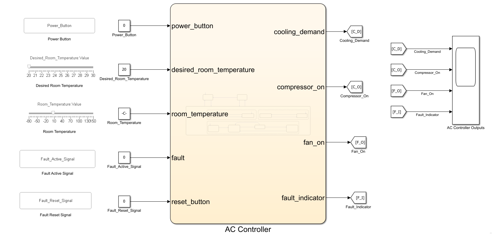

The model allows the controller inputs to be modified interactively during simulation. Simulation pause and resume were used to verify individual state transitions and timing checkpoints.

---

## Stateflow Design

The controller contains three top-level operating states:

| State | Purpose |
|---|---|
| `Power_Off` | Default safe state with compressor, fan, cooling demand, and fault indicator reset. |
| `Power_On` | Enabled operating state containing cooling-demand, compressor, and fan mechanisms. |
| `Fault_State` | Safe state entered when the generic fault input becomes active. |

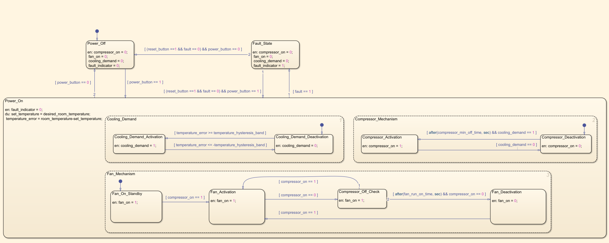

---

## Power-State Behavior

### Power Off

During `Power_Off`:

```text
compressor_on = 0
fan_on = 0
cooling_demand = 0
fault_indicator = 0
```

The controller transitions to `Power_On` when:

```text
power_button == 1
```

The controller returns to `Power_Off` when:

```text
power_button == 0
```

---

### Power On

During `Power_On`, the controller continuously updates:

```text
set_temperature = desired_room_temperature
temperature_error = room_temperature - set_temperature
```

The `Power_On` state contains three parallel Stateflow mechanisms:

- `Cooling_Demand`
- `Compressor_Mechanism`
- `Fan_Mechanism`

This structure separates temperature-demand evaluation from compressor protection and fan timing behavior.

---

## Cooling-Demand Mechanism

The cooling-demand mechanism contains:

| State | Output behavior |
|---|---|
| `Cooling_Demand_Activation` | `cooling_demand = 1` |
| `Cooling_Demand_Deactivation` | `cooling_demand = 0` |

Cooling demand becomes active when:

```text
temperature_error >= temperature_hysteresis_band
```

Cooling demand becomes inactive when:

```text
temperature_error <= -temperature_hysteresis_band
```

The demand state is retained while the temperature error remains between the two hysteresis thresholds.

---

## Compressor Mechanism

The compressor mechanism contains:

| State | Output behavior |
|---|---|
| `Compressor_Activation` | `compressor_on = 1` |
| `Compressor_Deactivation` | `compressor_on = 0` |

After compressor deactivation, restart is permitted only when:

```text
after(compressor_min_off_time, sec) &&
cooling_demand == 1
```

The compressor is deactivated when:

```text
cooling_demand == 0
```

The top-level power and fault transitions also force the compressor OFF.

The minimum-OFF timer protects the compressor from immediate restart when cooling demand is reactivated shortly after shutdown.

---

## Fan Mechanism

The fan mechanism contains:

| State | Purpose |
|---|---|
| `Fan_On_Standby` | Keeps the fan ON after entering `Power_On`, before compressor activation. |
| `Fan_Activation` | Keeps the fan ON while the compressor is active. |
| `Compressor_Off_Check` | Keeps the fan ON and starts the post-compressor run-on timing interval. |
| `Fan_Deactivation` | Turns the fan OFF after run-on expiry. |

When the compressor turns OFF, the controller enters `Compressor_Off_Check`:

```text
compressor_on == 0
```

During this state:

```text
fan_on = 1
```

The fan turns OFF only after:

```text
after(fan_run_on_time, sec) &&
compressor_on == 0
```

If the compressor restarts before the run-on time expires, the fan mechanism returns to `Fan_Activation`.

This persistence-check structure ensures that `fan_run_on_time` begins after compressor deactivation rather than from the initial fan activation time.

---

## Fault Handling

The generic `fault` input provides a temporary fault path for Ver. 01.

When:

```text
fault == 1
```

the controller enters `Fault_State` and applies:

```text
compressor_on = 0
fan_on = 0
cooling_demand = 0
fault_indicator = 1
```

A reset attempt is rejected while the fault remains active.

Valid reset requires:

```text
reset_button == 1 &&
fault == 0
```

The reset destination depends on the current power command:

```text
power_button == 0  -> Power_Off
power_button == 1  -> Power_On
```

This generic fault path will be replaced and expanded by sensor, operating-range, timeout, and invalid-mode fault logic in later versions.

---

## Symbols Pane

The Symbols pane records the controller inputs, outputs, parameters, and internal variables.

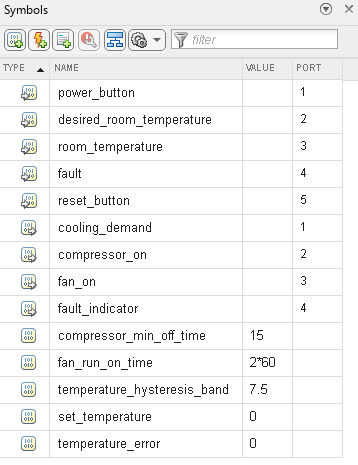

---

## Requirements

Ver. 01 implements eleven requirements.

| Requirement ID | Requirement Name | Summary |
|---|---|---|
| ACC-REQ-001 | System Initialization | Controller enters `Power_Off` with safe outputs after startup. |
| ACC-REQ-002 | Temperature Setpoint Input | Controller updates `set_temperature` from the desired room-temperature input. |
| ACC-REQ-003 | Power ON Command | Controller enters enabled operation, calculates temperature error, and evaluates cooling demand. |
| ACC-REQ-004 | Power OFF Command | Controller enters `Power_Off` and turns OFF compressor and fan. |
| ACC-REQ-005 | Cooling Demand Activation | Controller activates cooling demand when the positive hysteresis threshold is reached. |
| ACC-REQ-006 | Cooling Demand Deactivation | Controller removes cooling demand when the negative hysteresis threshold is reached. |
| ACC-REQ-007 | Compressor Minimum OFF Time | Controller prevents compressor restart until `compressor_min_off_time` has elapsed. |
| ACC-REQ-008 | Compressor Activation | Controller activates the compressor when demand is active and restart lockout has expired. |
| ACC-REQ-009 | Compressor Deactivation | Controller deactivates the compressor during demand removal, Power OFF, or fault. |
| ACC-REQ-010 | Fan Activation During Compressor Activation | Controller keeps the fan ON while the compressor is active. |
| ACC-REQ-011 | Fan Behavior After Compressor Deactivation | Controller keeps the fan ON for `fan_run_on_time` after compressor shutdown, then turns it OFF. |

---

## Requirements Authoring and Linking

The Ver. 01 requirements were authored from the spreadsheet source file and imported into Requirements Editor.

Requirement source files:

```text
requirements/ACC_Ver01_CoreControl_Requirements.xlsx
requirements/ACC_Ver01_CoreControl_Requirements.pdf
```

Generated requirements report:

```text
results/ACC_Ver01_CoreControl_Requirements_Report.pdf
```

The requirement-side linking view shows each requirement and its associated implementation elements.

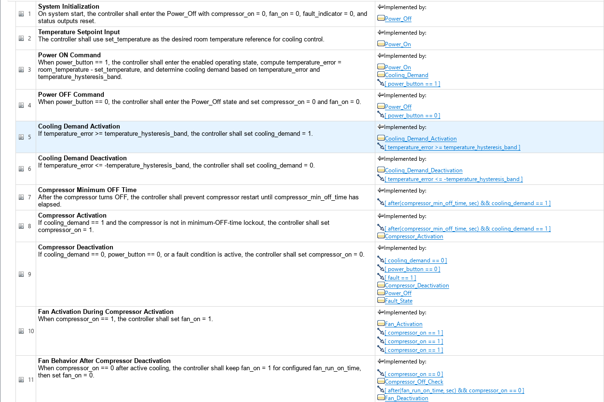

The Stateflow chart below shows requirement-link indicators on linked states, state actions, and transitions.

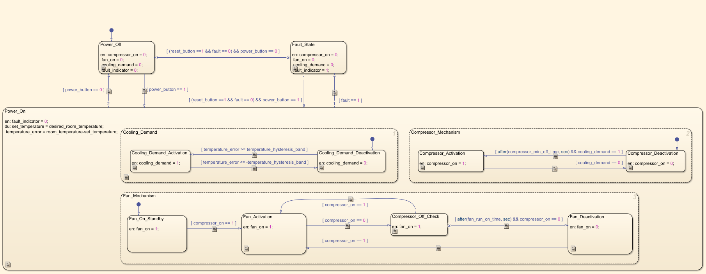

The links include:

- Stateflow states
- State entry actions
- Power-state transitions
- Cooling-demand hysteresis transitions
- Compressor minimum-OFF-time transition
- Compressor activation and deactivation states
- Fan activation transitions
- `Compressor_Off_Check`
- Fan run-on timer transition
- `Fan_Deactivation`

---

## Requirements Consistency Check

The Requirements Toolbox consistency check was rerun after the final Stateflow chart modifications.

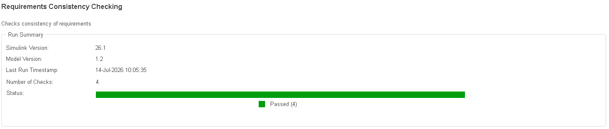

The generated report confirms that all four consistency checks passed.

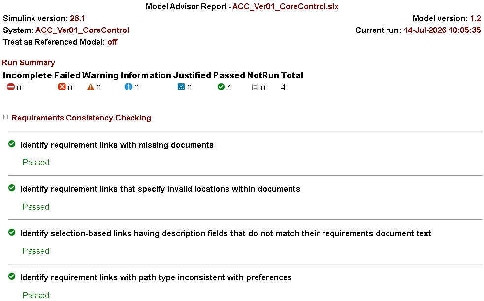

Generated report files:

```text
results/ACC_Ver01_CoreControl_Requirements_Consistency_Check_Report.html
results/ACC_Ver01_CoreControl_Requirements_Consistency_Check_Report.pdf
```

### Consistency Check Result

| Check Category | Result |
|---|---|
| Missing requirements documents | Pass |
| Invalid link locations | Pass |
| Selection-based link-description consistency | Pass |
| Path-type consistency | Pass |

### Overall result

```text
4 checks passed
0 failed
0 warnings
0 incomplete
0 not run
```

---

## Traceability Matrix

A traceability matrix was generated after linking the final Ver. 01 implementation to the eleven requirements.

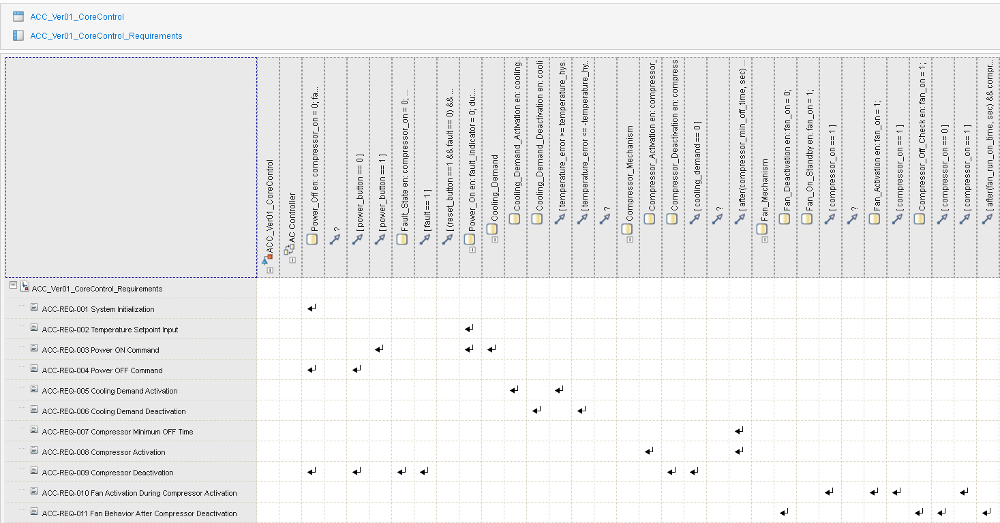

Generated traceability files:

```text
results/ACC_Ver01_CoreControl_Requirements_Traceability_Matrix.html
results/ACC_Ver01_CoreControl_Requirements_Traceability_Matrix.xlsx
```

The matrix confirms bidirectional mapping between the requirement set and the implemented Stateflow states, actions, and transitions.

---

# Simulation Verification

Ver. 01 was manually verified through four behavioral simulation rounds. A fifth round was used to verify the final requirements linking and traceability after the chart modifications.

Scope screenshots are stored in `results/`. Stateflow, Symbols pane, and top-level model screenshots are stored in `images/`.

---

## Round 1: Power ON and Power OFF Without Cooling Demand

Round 1 verifies basic power-state behavior without active cooling demand.

### Expected behavior

| Operating condition | `cooling_demand` | `compressor_on` | `fan_on` | `fault_indicator` |
|---|---:|---:|---:|---:|
| Power Off | 0 | 0 | 0 | 0 |
| Power On without demand | 0 | 0 | 1 | 0 |
| Return to Power Off | 0 | 0 | 0 | 0 |

### Scope result

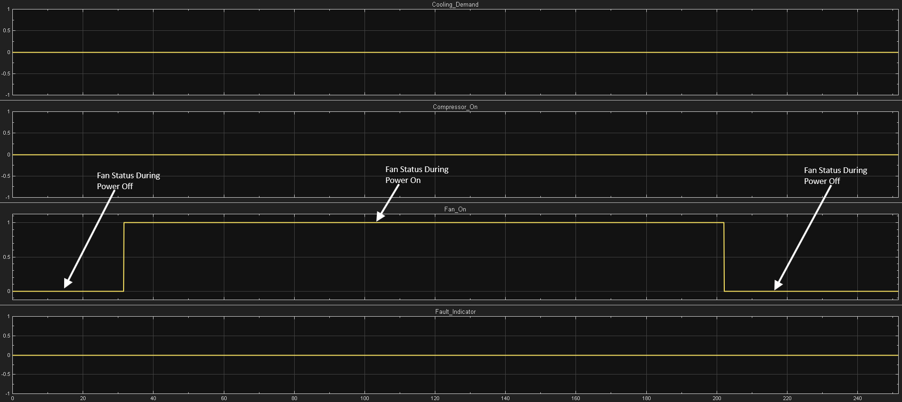

### State evidence

| Checkpoint | Evidence |
|---|---|
| Power Off initialization | [Power Off](images/ACC_Ver01_CoreControl_Chart_r1_Power_Off_Initialization.png) |
| Power On | [Power On](images/ACC_Ver01_CoreControl_Chart_r1_Power_On.png) |
| Power On to Power Off | [Power Off transition](images/ACC_Ver01_CoreControl_Chart_r1_Power_On_to_Power_Off.png) |
| Symbols pane | [Power state values](images/ACC_Ver01_CoreControl_Chart_r1_Symbols_Pane_Power_Off_Power_On_Without_Cooling_Demand.png) |

### Key observations

- All outputs remain safe during `Power_Off`.
- The fan enters `Fan_On_Standby` after Power ON.
- The compressor remains OFF because cooling demand is inactive.
- Returning to `Power_Off` turns the fan OFF.
- `fault_indicator` remains 0.

### Result: **Pass**

---

## Round 2: Cooling Demand, Compressor Lockout, and Fan Run-On

Round 2 verifies the complete core cooling-control sequence.

The test includes:

- Cooling-demand activation
- Compressor activation
- Initial cooling-demand deactivation
- Cooling-demand reactivation before lockout expiry
- Compressor restart prevention
- Compressor restart after minimum-OFF-time expiry
- Cooling maintained beyond `fan_run_on_time`
- Final compressor deactivation
- Fan run-on
- Fan shutdown after timeout

### Scope results

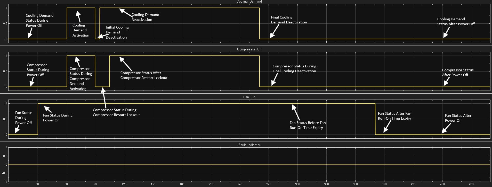

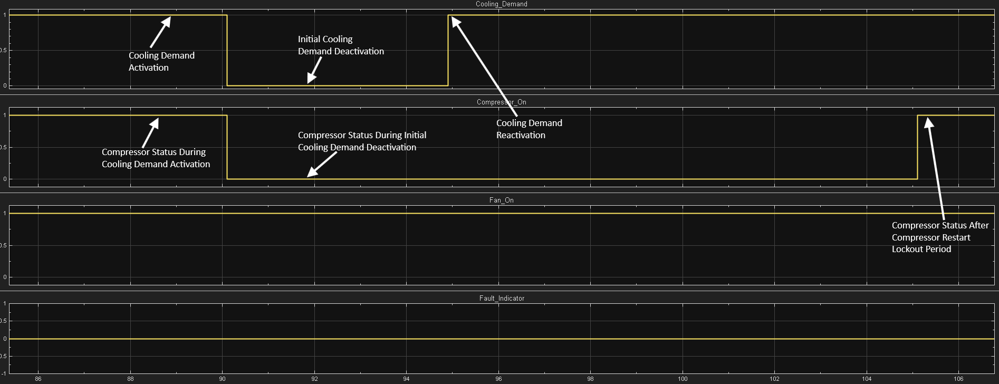

### Approximate Simulation Timeline

| Check | Approximate time or interval |
|---|---:|
| Power Off initialization | 0 s |
| Power On without cooling demand | 30 s |
| Cooling-demand activation | 60 s |
| Initial cooling-demand deactivation | 90 s |
| Demand reactivated before lockout expiry | 95 s |
| Compressor restart lockout | 90 to 105 s |
| Compressor restart | Approximately 105 s |
| Cooling maintained | 105 to 260 s |
| Final cooling-demand deactivation | 260 s |
| Fan run-on before timeout expiry | 379 s |
| Fan deactivation after timeout expiry | 380 s |
| Final Power Off | 440 s |

The compressor lockout interval is consistent with:

```text
compressor_min_off_time = 15 s
```

The fan run-on interval is consistent with:

```text
380 s - 260 s = 120 s
fan_run_on_time = 120 s
```

### Selected Evidence

| Checkpoint | Chart | Symbols Pane |
|---|---|---|
| Power On with cooling demand active | [Chart](images/ACC_Ver01_CoreControl_Chart_r2_Power_On_with_Cooling_Demand_Active.png) | [Symbols](images/ACC_Ver01_CoreControl_Chart_r2_Symbols_Pane_Power_On_with_Cooling_Demand_Active.png) |
| Initial cooling-demand deactivation | [Chart](images/ACC_Ver01_CoreControl_Chart_r2_Initial_Cooling_Demand_Deactivation.png) | |
| Cooling demand reactivated before lockout expiry | [Chart](images/ACC_Ver01_CoreControl_Chart_r2_Cooling_Demand_Reactivated_Before_Lockout_Expiry.png) | [Symbols](images/ACC_Ver01_CoreControl_Chart_r2_Symbols_Pane_Cooling_Demand_Reactivated_Before_Lockout_Expiry.png) |
| Compressor restart after lockout expiry | [Chart](images/ACC_Ver01_CoreControl_Chart_r2_Compressor_Restart_After_Lockout_Expiry.png) | [Symbols](images/ACC_Ver01_CoreControl_Chart_r2_Symbols_Pane_Compressor_Restart_After_Lockout_Expiry.png) |
| Final cooling-demand deactivation | [Chart](images/ACC_Ver01_CoreControl_Chart_r2_Final_Cooling_Demand_Deactivation.png) | |
| Fan run-on before timeout expiry | [Chart](images/ACC_Ver01_CoreControl_Chart_r2_Fan_Run_On_Before_Timeout_Expiry.png) | [Symbols](images/ACC_Ver01_CoreControl_Chart_r2_Symbols_Pane_Fan_Run_On_Before_Timeout_Expiry.png) |
| Fan run-on after timeout expiry | [Chart](images/ACC_Ver01_CoreControl_Chart_r2_Fan_Run_On_After_Timeout_Expiry.png) | [Symbols](images/ACC_Ver01_CoreControl_Chart_r2_Symbols_Pane_Fan_Run_On_After_Timeout_Expiry.png) |

The selected chart and Symbols-pane screenshots provide state-level and runtime-value evidence for the major Round 2 checkpoints. The two scope images provide the complete sequence and a focused view of the compressor restart lockout interval.

### Key observations

- Cooling demand responds correctly to the configured hysteresis thresholds.
- Compressor shutdown occurs immediately after demand removal.
- Demand reactivation does not immediately restart the compressor.
- Compressor restart occurs only after the minimum-OFF time expires.
- The fan remains ON while the compressor is active.
- The fan remains ON in `Compressor_Off_Check`.
- The fan turns OFF only after the complete run-on interval.
- `fault_indicator` remains 0 throughout normal operation.

### Result: **Pass**

---

## Round 3: Fault Activation and Reset to Power Off

Round 3 verifies generic fault activation during powered cooling operation, invalid reset while the fault remains active, and valid recovery to `Power_Off`.

### Sequence

```text
Active cooling
-> Fault_State
-> reset attempted while fault remains active
-> Fault_State retained
-> fault cleared
-> reset asserted with power_button = 0
-> Power_Off
```

### Scope results

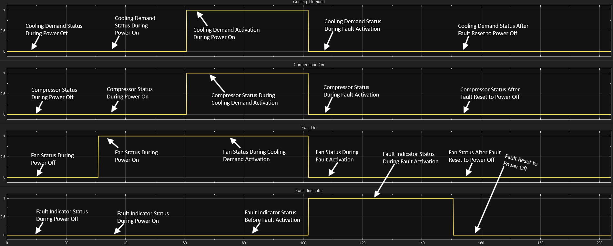

### Selected evidence

| Checkpoint | Chart | Symbols Pane | Top-Level Model |
|---|---|---|---|
| Active cooling before fault | [Chart](images/ACC_Ver01_CoreControl_Chart_r3_Power_On_with_Active_Cooling.png) | [Symbols](images/ACC_Ver01_CoreControl_Chart_r3_Symbols_Pane_Power_On_with_Active_Cooling.png) | |
| Fault activation | [Chart](images/ACC_Ver01_CoreControl_Chart_r3_Fault_Activation.png) | [Symbols](images/ACC_Ver01_CoreControl_Chart_r3_Symbols_Pane_Fault_Activation.png) | [Model](images/ACC_Ver01_CoreControl_Model_r3_Fault_Activation.png) |
| Reset attempted with active fault | [Chart](images/ACC_Ver01_CoreControl_Chart_r3_Fault_Reset_with_Active_Fault.png) | [Symbols](images/ACC_Ver01_CoreControl_Chart_r3_Symbols_Pane_Fault_Reset_with_Active_Fault.png) | [Model](images/ACC_Ver01_CoreControl_Model_r3_Fault_Reset_with_Active_Fault.png) |
| Valid reset to Power Off | [Chart](images/ACC_Ver01_CoreControl_Chart_r3_Fault_Reset_to_Power_Off_with_Inactive_Fault.png) | [Symbols](images/ACC_Ver01_CoreControl_Chart_r3_Symbols_Pane_Fault_Reset_to_Power_Off_with_Inactive_Fault.png) | [Model](images/ACC_Ver01_CoreControl_Model_r3_Fault_Reset_to_Power_Off_with_Inactive_Fault.png) |

### Key observations

- Fault activation overrides active cooling.
- Compressor, fan, and cooling demand are forced OFF.
- `fault_indicator` becomes 1.
- Reset is blocked while `fault == 1`.
- Valid reset requires the fault input to be cleared.
- With `power_button == 0`, valid reset returns the controller to `Power_Off`.

### Result: **Pass**

---

## Round 4: Fault Activation and Reset to Power On

Round 4 verifies valid recovery from `Fault_State` to `Power_On`.

### Sequence

```text
Active cooling
-> Fault_State
-> invalid reset while fault remains active
-> fault cleared
-> valid reset with power_button = 1
-> Power_On
-> compressor restart lockout
-> compressor restart after lockout expiry
```

### Scope result

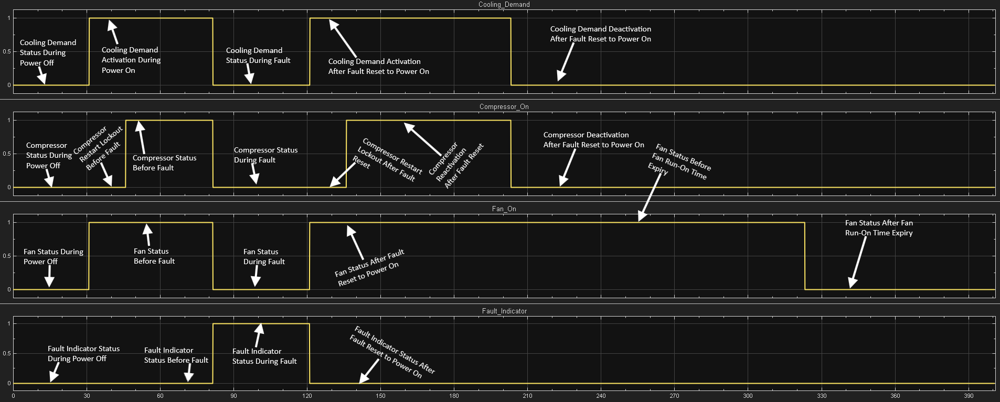

### Selected evidence

| Checkpoint | Chart | Symbols Pane | Top-Level Model |
|---|---|---|---|
| Fault activation | [Chart](images/ACC_Ver01_CoreControl_Chart_r4_Power_On_Fault_Activation.png) | [Symbols](images/ACC_Ver01_CoreControl_Chart_r4_Symbols_Pane_Power_On_Fault_Activation.png) | [Model](images/ACC_Ver01_CoreControl_Model_r4_Power_On_Fault_Activation.png) |
| Reset attempted with active fault | [Chart](images/ACC_Ver01_CoreControl_Chart_r4_Power_On_Fault_Reset_with_Active_Fault.png) | [Symbols](images/ACC_Ver01_CoreControl_Chart_r4_Symbols_Pane_Power_On_Fault_Reset_with_Active_Fault.png) | [Model](images/ACC_Ver01_CoreControl_Model_r4_Power_On_Fault_Reset_with_Active_Fault.png) |
| Valid reset to Power On | [Chart](images/ACC_Ver01_CoreControl_Chart_r4_Fault_Reset_to_Power_On.png) | [Symbols](images/ACC_Ver01_CoreControl_Chart_r4_Symbols_Pane_Fault_Reset_to_Power_On.png) | [Model](images/ACC_Ver01_CoreControl_Model_r4_Fault_Reset_to_Power_On.png) |
| Compressor lockout after reset | | [Symbols](images/ACC_Ver01_CoreControl_Chart_r4_Symbols_Pane_Power_On_During_Compressor_Restart_Lockout_with_Cooling_Demand_Activation.png) | |
| Compressor restart after lockout | [Chart](images/ACC_Ver01_CoreControl_Chart_r4_Power_On_After_Compressor_Restart_Lockout_with_Cooling_Demand_Activation.png) | [Symbols](images/ACC_Ver01_CoreControl_Chart_r4_Symbols_Pane_Power_On_After_Compressor_Restart_Lockout_with_Cooling_Demand_Activation.png) | |

### Key observations

- `Fault_State` forces all controlled outputs OFF.
- Reset remains blocked while the fault input is active.
- Valid reset with `power_button == 1` returns the controller to `Power_On`.
- Cooling demand is reevaluated after recovery.
- The compressor does not restart immediately after fault-induced shutdown.
- Minimum-OFF-time protection remains effective after fault reset.
- The fan becomes active during recovered Power-On operation.
- Compressor operation resumes only after lockout expiry.

### Result: **Pass**

---

## Round 5: Requirements Linking, Consistency, and Traceability

Round 5 was completed after the final Stateflow chart modifications.

It verifies:

- requirement links point to the final implementation structure
- obsolete links from earlier fan-mechanism revisions are removed
- the fan run-on requirement is linked to the persistence-check sequence
- all consistency checks pass
- the traceability matrix reflects the final Ver. 01 model

### Evidence

- [Chart with links](images/ACC_Ver01_CoreControl_r5_Chart_with_Links.png)
- [Requirements with links](images/ACC_Ver01_CoreControl_r5_Requirements_with_Links.png)
- [Consistency check](images/ACC_Ver01_CoreControl_r5_Requirements_Consistency_Check.png)
- [Consistency report](images/ACC_Ver01_CoreControl_r5_Requirements_Consistency_Check_Report.png)
- [Traceability matrix](images/ACC_Ver01_CoreControl_r5_Requirements_Traceability_Matrix.png)

### Result: **Pass**

---

## Verification Summary

| Verification Item | Requirement Coverage | Status |
|---|---|---|
| System initialization | ACC-REQ-001 | ✅ Pass |
| Temperature setpoint handling | ACC-REQ-002 | ✅ Pass |
| Power ON behavior | ACC-REQ-003 | ✅ Pass |
| Power OFF behavior | ACC-REQ-004 | ✅ Pass |
| Cooling-demand activation | ACC-REQ-005 | ✅ Pass |
| Cooling-demand deactivation | ACC-REQ-006 | ✅ Pass |
| Compressor minimum-OFF-time protection | ACC-REQ-007 | ✅ Pass |
| Compressor activation | ACC-REQ-008 | ✅ Pass |
| Compressor deactivation | ACC-REQ-009 | ✅ Pass |
| Fan activation during compressor operation | ACC-REQ-010 | ✅ Pass |
| Fan run-on after compressor deactivation | ACC-REQ-011 | ✅ Pass |
| Generic fault activation | Supporting Ver. 01 behavior | ✅ Pass |
| Reset blocked while fault remains active | Supporting Ver. 01 behavior | ✅ Pass |
| Fault reset to Power Off | Supporting Ver. 01 behavior | ✅ Pass |
| Fault reset to Power On | Supporting Ver. 01 behavior | ✅ Pass |
| Requirement authoring and linking | ACC-REQ-001 to ACC-REQ-011 | ✅ Pass |
| Requirements consistency check | Requirements Toolbox checks | ✅ Pass |
| Traceability matrix generation | Requirements to implementation | ✅ Pass |

---

## Observability Note

In Ver. 01, some controller states can produce identical actuator outputs.

For example:

```text
Power_On with Fan_Deactivation:
cooling_demand = 0
compressor_on = 0
fan_on = 0

Power_Off:
cooling_demand = 0
compressor_on = 0
fan_on = 0
```

Because the outputs are identical, the final transition to `Power_Off` may not create a distinct scope edge.

Stateflow animation was therefore used as state-transition evidence.

A dedicated `controller_status` output and top-level controller-status display are planned for Ver. 04. This will improve external observability in the same way that the Washing Machine Controller Ver. 03 introduced top-level stage-status visibility.

---

## Verification Improvement Planned for Later Versions

In Ver. 01, `temperature_error`, `room_temperature`, and `desired_room_temperature` are not routed together to the verification scope.

The Symbols pane was used to record these values during hysteresis verification.

In a later version, these signals may be exposed as diagnostic outputs or routed to a dedicated verification scope to make temperature-demand evidence easier to review without changing the controller behavior.

---

## Learning Outcomes

This version demonstrates:

- Requirement-based Stateflow controller development
- Parallel Stateflow state decomposition
- Continuous update of controller reference and temperature error
- Hysteresis-based cooling-demand logic
- Compressor minimum-OFF-time protection
- Post-compressor fan run-on behavior
- Persistence-check state design
- Separation of cooling demand, compressor logic, and fan logic
- Safe Power-Off handling
- Generic fault-state handling
- Fault override during active cooling
- Reset blocking while the fault remains active
- Conditional reset destination based on power command
- Post-fault compressor restart protection
- Manual simulation checkpoint planning
- Approximate simulation-time recording
- Scope annotation and evidence collection
- Requirement authoring and linking
- Requirements consistency checking
- Traceability matrix generation
- Iterative debugging and model refinement

---

## Limitations of Ver. 01

Ver. 01 focuses on core controller behavior and does not include:

- Cooling, Fan-only, and Auto operating modes
- Automatic fan-speed selection
- Manual fan-speed override
- Dedicated compressor-lockout diagnostic output
- Temperature-sensor plausibility checking
- Under-temperature and over-temperature warnings
- Temperature timeout faults
- Invalid-mode fault handling
- Fault-specific reset logic
- Dedicated `controller_status` output
- Top-level operating-status display
- Formal Simulink Test test harness
- Test Manager execution
- Automated pass/fail assessments
- Code-generation workflow
- Hardware deployment

These features are planned for later controller versions and the subsequent validation workflow.

---

## Version Progression

| Version | Planned focus |
|---|---|
| Ver. 01 | Core control logic, temperature hysteresis, compressor protection, fan run-on, and generic fault-path verification |
| Ver. 02 | Operating-mode selection, automatic and manual fan-speed control |
| Ver. 03 | Sensor plausibility, operating-temperature monitoring, timeout faults, fault responses, and fault resets |
| Ver. 04 | Controller diagnostics, top-level observability, status output, and final model enhancement |

---

## Conclusion

ACC Ver. 01 establishes the core supervisory-control foundation for the Air Conditioning Controller.

The controller successfully demonstrates:

- safe initialization
- Power ON and Power OFF behavior
- temperature-error calculation
- cooling-demand hysteresis
- compressor minimum-OFF-time protection
- compressor restart after lockout expiry
- fan standby behavior
- post-compressor fan run-on
- fan shutdown after run-on expiry
- safe generic fault handling
- reset blocking while the fault remains active
- recovery to either Power Off or Power On

The implementation is supported by authored requirements, linked Stateflow elements, consistency-check evidence, a generated traceability matrix, and four rounds of behavioral simulation verification.

This version provides a verified base for the next development stage, where operating modes and fan-speed control will be added without replacing the established Ver. 01 behavior.

---

## License

MIT License

---
