# Air Conditioning Controller, Ver. 02: Operating Modes

## Project Overview

This project implements Ver. 02 of a requirement-based Air Conditioning Controller using MATLAB, Simulink, Stateflow, and Requirements Toolbox.

Ver. 02 extends the verified core controller developed in Ver. 01 by introducing operating-mode supervision, manual and automatic fan-speed control, manual override in Automatic Mode, cross-mode transition handling, and fresh compressor lockout whenever cooling control is re-enabled.

The main objective of this version is to add supervisory operating modes without replacing the established Ver. 01 cooling-demand, compressor-protection, fan-run-on, Power-Off, and generic fault-handling behavior.

The controller retains the top-level states:

- `Power_Off`
- `Power_On`
- `Fault`

Inside `Power_On`, Ver. 02 adds two coordinated parallel mechanisms:

- `Operating_Mode_Control`
- `Cooling_Control_and_Fan_Speed_Control_Mechanism`

The cooling and fan-speed mechanism contains:

- `Cooling_Control_Mechanism`
- `Automatic_Fan_Speed_Selection`
- `Manual_Fan_Speed_Selection`

This structure separates operating-mode supervision from the shared cooling-control implementation.

---

## Version Scope

Ver. 02 covers:

- Safe system initialization
- Power ON and Power OFF behavior
- Desired room-temperature input
- Continuous temperature-error calculation
- Power-On Standby behavior
- Fan-only Mode selection and response
- Cooling Mode selection and response
- Automatic Mode selection and response
- Automatic fan-speed selection
- Manual fan-speed selection
- Manual fan-speed override in Automatic Mode
- Cross-mode transitions
- Cooling-control continuity between Cooling and Automatic modes
- Cooling-control deactivation in Fan-only Mode and Power-On Standby
- Fresh compressor lockout when cooling control is re-enabled
- Cooling-demand activation and deactivation using hysteresis
- Compressor activation and deactivation
- Compressor minimum-OFF-time protection
- Compressor-lockout status indication
- Fan activation during compressor operation
- Fan run-on after compressor deactivation
- Generic fault activation
- Invalid reset blocking while the fault remains active
- Valid fault reset to Power-On Standby
- Valid fault reset to Power Off
- Post-reset fresh compressor lockout
- Requirement authoring and implementation linking
- Requirements consistency checking
- Requirements traceability matrix generation
- Manual simulation verification across seven behavioral review rounds

---

## Tools Used

- MATLAB R2026a
- Simulink
- Stateflow
- Requirements Toolbox

---

## Folder Structure

```text
ACC-Ver02-OperatingModes/
|-- images/
|   |-- model_and_stateflow_architecture_images
|   |-- operating_mode_verification_images
|   |-- cooling_control_verification_images
|   |-- fan_speed_verification_images
|   |-- fault_and_reset_verification_images
|   |-- requirements_linking_images
|   |-- requirements_consistency_check_images
|   `-- requirements_traceability_matrix_images
|-- model/
|   `-- ACC_Ver02_Operating_Modes.slx
|-- requirements/
|   |-- ACC-Ver02-OperatingModes_Requirements.pdf
|   |-- ACC-Ver02-OperatingModes_Requirements.xlsx
|   |-- ACC_Ver02_Operating_Modes_Requirements.slreqx
|   `-- ACC_Ver02_Operating_Modes~mdl.slmx
|-- results/
|   |-- ACC_Ver02_Operating_Modes_Automatic_Manual_Override_and_Cross_Mode_Transitions_Cooling_Control_Scope_Results.png
|   |-- ACC_Ver02_Operating_Modes_Automatic_Manual_Override_and_Cross_Mode_Transitions_Temperature_Hysterisis_Scope_Results.png
|   |-- ACC_Ver02_Operating_Modes_Core_Power_Off_Power_On_Cooling_Control_Scope_Results.png
|   |-- ACC_Ver02_Operating_Modes_Core_Power_Off_Power_On_Temperature_Hysterisis_Scope_Results.png
|   |-- ACC_Ver02_Operating_Modes_Fault_Activation_and_Reset_Regression_Verification_Cooling_Control_Scope_Results.png
|   |-- ACC_Ver02_Operating_Modes_Fault_Activation_and_Reset_Regression_Verification_Temperature_Hysterisis_Scope_Results.png
|   |-- ACC_Ver02_Operating_Modes_Power_On_Automatic_Mode_Operating_Mode_Cooling_Control_Scope_Results.png
|   |-- ACC_Ver02_Operating_Modes_Power_On_Automatic_Mode_Operating_Mode_Temperature_Hysterisis_Scope_Results.png
|   |-- ACC_Ver02_Operating_Modes_Power_On_Cooling_Mode_Operating_Mode_Cooling_Control_Scope_Results.png
|   |-- ACC_Ver02_Operating_Modes_Power_On_Cooling_Mode_Operating_Mode_Temperature_Hysterisis_Scope_Results.png
|   |-- ACC_Ver02_Operating_Modes_Power_On_Fan_Only_Operating_Mode_Cooling_Control_Scope_Results.png
|   |-- ACC_Ver02_Operating_Modes_Power_On_Fan_Only_Operating_Mode_Temperature_Hysterisis_Scope_Results.png
|   |-- ACC_Ver02_Operating_Modes_Power_On_Standby_and_Power_On_Operating_Mode_Cooling_Control_Scope_Results.png
|   |-- ACC_Ver02_Operating_Modes_Power_On_Standby_and_Power_On_Operating_Mode_Temperature_Hysterisis_Scope_Results.png
|   |-- ACC_Ver02_Operating_Modes_Requirements.pdf
|   |-- ACC_Ver02_Operating_Modes_Requirements_Consistency_Check_Report.html
|   |-- ACC_Ver02_Operating_Modes_Requirements_Consistency_Check_Report.pdf
|   |-- ACC_Ver02_Operating_Modes_Requirements_Traceability_Matrix_Report.html
|   `-- ACC_Ver02_Operating_Modes_Requirements_Traceability_Report.xlsx
`-- README.md
```

> The `images/` folder contains 196 retained screenshots covering the model, Stateflow chart, Symbols pane, operating states, transitions, requirement links, consistency checking, and traceability. The `results/` folder contains 14 retained scope-result images, together with generated requirements, consistency-check, and traceability reports.

---

## Controller Interface

### Inputs

| Signal | Description |
|---|---|
| `power_button` | Enables or disables controller operation. |
| `desired_room_temperature` | User-selected room-temperature reference. |
| `room_temperature` | Current measured room temperature. |
| `mode_enabled` | Enables the operating-mode hierarchy when set to 1. |
| `mode_selected` | Selects Fan-only, Cooling, or Automatic Mode. |
| `fan_speed_user_input` | Selects the manual fan-speed command. |
| `manual_fan_override` | Enables manual fan-speed control while Automatic Mode remains active. |
| `fault` | Generic external fault input used for regression verification. |
| `reset_button` | Requests controller recovery after the fault is cleared. |

---

### Outputs

| Signal | Description |
|---|---|
| `cooling_demand` | Indicates whether cooling is required. |
| `compressor_on` | Commands compressor activation or deactivation. |
| `compressor_lockout` | Indicates that compressor restart is temporarily inhibited. |
| `fan_on` | Commands fan activation or deactivation. |
| `fan_speed_cmd` | Commands OFF, Low, Medium, or High fan speed. |
| `fault_indicator` | Indicates that the controller is operating in `Fault`. |
| `fan_only_mode_enabled` | Indicates active Fan-only Mode. |
| `cooling_mode_enabled` | Indicates active Cooling Mode. |
| `automatic_mode_enabled` | Indicates active Automatic Mode. |
| `automatic_fan_speed_enabled` | Indicates whether automatic fan-speed selection is active. |

---

### Parameters

| Parameter | Purpose |
|---|---|
| `temperature_hysteresis_band` | Defines cooling-demand activation and deactivation thresholds. |
| `compressor_min_off_time` | Prevents immediate compressor restart after shutdown. |
| `fan_run_on_time` | Keeps the fan ON after compressor deactivation. |
| `medium_speed_threshold` | Defines the transition from Low to Medium automatic fan speed. |
| `high_speed_threshold` | Defines the transition from Medium to High automatic fan speed. |

The verification used:

```text
compressor_min_off_time = 15 s
fan_run_on_time = 120 s
```

---

### Internal Variables

| Variable | Description |
|---|---|
| `set_temperature` | Internal temperature reference updated from `desired_room_temperature`. |
| `temperature_error` | Difference between room temperature and set temperature. |
| `cooling_control_enabled` | Enables or disables the shared cooling-control mechanism. |

The controller calculates:

```text
temperature_error = room_temperature - set_temperature
```

Cooling demand is activated when:

```text
temperature_error >= temperature_hysteresis_band
```

Cooling demand is deactivated when:

```text
temperature_error <= -temperature_hysteresis_band
```

The active demand state is retained while temperature error remains between the two hysteresis thresholds.

---

## Top-Level Simulink Model

The top-level Simulink model contains interactive controls for:

- Power command
- Desired temperature
- Room temperature
- Operating-mode enable
- Operating-mode selection
- Manual fan-speed selection
- Automatic-mode manual override
- Generic fault activation
- Fault reset

The controller outputs are routed to visual displays and verification scopes.

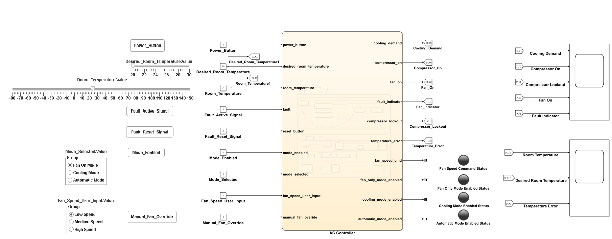

Simulation pause and resume were used to modify inputs, inspect Stateflow activity, confirm Symbols pane values, and capture timing checkpoints.

---

## Stateflow Design

The controller contains three top-level states:

| State | Purpose |
|---|---|
| `Power_Off` | Default safe state. |
| `Power_On` | Enabled state containing mode supervision and cooling control. |
| `Fault` | Safe state entered when the generic fault becomes active. |

Representative Stateflow chart-overview images:

- [Power Off, Power On, and Fault view](images/ACC_Ver02_Operating_Modes_Chart_Power_Off_On_Fault.png)
- [Operating Modes Control](images/ACC_Ver02_Operating_Modes_Chart_Operating_Modes_Control.png)
- [Cooling Control Mechanism](images/ACC_Ver02_Operating_Modes_Chart_Cooling_Control_Mechanism.png)
- [Automatic Fan-Speed Selection](images/ACC_Ver02_Operating_Modes_Chart_Automatic_Fan_Speed_Selection.png)
- [Manual Fan-Speed Selection](images/ACC_Ver02_Operating_Modes_Chart_Manual_Fan_Speed_Selection.png)

Inside `Power_On`, two parallel mechanisms are used:

| Parallel mechanism | Purpose |
|---|---|
| `Operating_Mode_Control` | Selects standby, Fan-only, Cooling, or Automatic Mode. |
| `Cooling_Control_and_Fan_Speed_Control_Mechanism` | Executes cooling control and fan-speed command selection. |

---

## Operating-Mode Control

The operating-mode hierarchy contains:

- `Power_On_Standby`
- `Power_On_Operating_Modes`

The `Power_On_Operating_Modes` state contains:

- `Fan_Only_Mode`
- `Cooling_Mode`
- `Automatic_Mode`

Mode selection uses:

| `mode_selected` | Selected mode |
|---:|---|
| `0` | Fan-only Mode |
| `1` | Cooling Mode |
| `2` | Automatic Mode |

When:

```text
mode_enabled == 0
```

the controller enters or returns to:

```text
Power_On_Standby
```

When:

```text
mode_enabled == 1
```

the controller enters `Power_On_Operating_Modes` and selects the requested child mode.

---

## Power-On Standby

`Power_On_Standby` is the default state after Power ON.

During standby:

```text
cooling_demand = 0
compressor_on = 0
compressor_lockout = 0
fan_on = 1
fan_speed_cmd = 1

fan_only_mode_enabled = 0
cooling_mode_enabled = 0
automatic_mode_enabled = 0
cooling_control_enabled = 0
```

This state provides powered standby operation while preventing cooling activation.

---

## Fan-only Mode

During Fan-only Mode:

```text
fan_only_mode_enabled = 1
cooling_mode_enabled = 0
automatic_mode_enabled = 0
cooling_control_enabled = 0
compressor_on = 0
cooling_demand = 0
fan_on = 1
```

Fan speed is controlled manually using `fan_speed_user_input`.

The manual mapping is:

| `fan_speed_user_input` | `fan_speed_cmd` |
|---:|---:|
| `0` | `1`, Low |
| `1` | `2`, Medium |
| `2` | `3`, High |
| Unsupported value | `1`, Low fallback |

This ensures that an invalid manual input does not produce an unsupported fan command.

---

## Cooling Mode

During Cooling Mode:

```text
fan_only_mode_enabled = 0
cooling_mode_enabled = 1
automatic_mode_enabled = 0
cooling_control_enabled = 1
automatic_fan_speed_enabled = 0
```

The shared cooling-control mechanism is enabled.

Fan speed is selected manually.

The Ver. 01 hysteresis, compressor-protection, fan-activation, and fan-run-on behaviors remain active.

---

## Automatic Mode

During Automatic Mode:

```text
fan_only_mode_enabled = 0
cooling_mode_enabled = 0
automatic_mode_enabled = 1
cooling_control_enabled = 1
```

Automatic fan-speed selection is used by default.

When:

```text
manual_fan_override == 1
```

manual fan-speed selection becomes active while Automatic Mode remains selected.

When:

```text
manual_fan_override == 0
```

control returns to automatic fan-speed selection.

---

## Automatic Fan-Speed Selection

Automatic fan speed is continuously reevaluated.

The implemented decision logic is:

```matlab
if fan_on == 0
    fan_speed_cmd = 0;
elseif compressor_on == 0
    fan_speed_cmd = 1;
elseif temperature_error < medium_speed_threshold
    fan_speed_cmd = 1;
elseif temperature_error < high_speed_threshold
    fan_speed_cmd = 2;
else
    fan_speed_cmd = 3;
end
```

The threshold behavior is:

| Operating condition | `fan_speed_cmd` |
|---|---:|
| Fan OFF | 0 |
| Fan ON and compressor OFF | 1 |
| Compressor ON and `temperature_error < medium_speed_threshold` | 1 |
| Compressor ON and `medium_speed_threshold <= temperature_error < high_speed_threshold` | 2 |
| Compressor ON and `temperature_error >= high_speed_threshold` | 3 |

The equality boundary:

```text
temperature_error == high_speed_threshold
```

selects High Speed.

---

## Cooling-Control Mechanism

The shared cooling-control mechanism contains:

- `Cooling_Control_Standby`
- `Cooling_Control`

`Cooling_Control` contains three parallel mechanisms:

- `Cooling_Demand`
- `Compressor_Mechanism`
- `Fan_Mechanism`

When cooling control is disabled:

```text
cooling_control_enabled == 0
```

the chart enters `Cooling_Control_Standby`.

When cooling control is enabled:

```text
cooling_control_enabled == 1
```

the chart enters `Cooling_Control`.

Because the cooling-control history is not retained after disable, a fresh compressor lockout is applied whenever cooling control is re-enabled.

---

## Compressor Mechanism

The compressor mechanism contains:

| State | Output behavior |
|---|---|
| `Compressor_Lockout` | Compressor OFF and lockout indication active. |
| `Compressor_Activation` | Compressor ON and lockout indication inactive. |
| `Compressor_Deactivation` | Compressor OFF and ready for immediate activation when demand returns. |

The default state after fresh cooling-control activation is:

```text
Compressor_Lockout
```

The main transitions are:

```text
Compressor_Activation
-> Compressor_Lockout
when cooling_demand == 0
```

```text
Compressor_Lockout
-> Compressor_Activation
when after(compressor_min_off_time, sec) &&
cooling_demand == 1
```

```text
Compressor_Lockout
-> Compressor_Deactivation
when after(compressor_min_off_time, sec) &&
cooling_demand == 0
```

```text
Compressor_Deactivation
-> Compressor_Activation
when cooling_demand == 1
```

The final transition allows immediate restart from the OFF-and-ready state because the minimum OFF time has already elapsed.

---

## Fan Mechanism

The Ver. 01 fan mechanism is retained.

The fan mechanism contains:

| State | Purpose |
|---|---|
| `Fan_On_Standby` | Keeps the fan ON before compressor activation. |
| `Fan_Activation` | Keeps the fan ON while the compressor is active. |
| `Compressor_Off_Check` | Keeps the fan ON and starts the run-on timer. |
| `Fan_Deactivation` | Turns the fan OFF after run-on expiry. |

After compressor deactivation:

```text
fan_on = 1
```

The fan remains ON until:

```text
after(fan_run_on_time, sec) &&
compressor_on == 0
```

If the compressor restarts before timeout expiry, the fan mechanism returns to `Fan_Activation`.

---

## Cross-Mode Transition Behavior

### Automatic Mode to Cooling Mode

Cooling control remains enabled across this transition.

Expected continuity:

```text
cooling_control_enabled = 1
cooling_demand retained
compressor state retained
compressor_lockout state retained
```

No fresh compressor lockout is introduced solely because the operating mode changes from Automatic to Cooling.

### Cooling Mode to Fan-only Mode

Entering Fan-only Mode disables cooling control.

Expected behavior:

```text
cooling_control_enabled = 0
cooling_demand = 0
compressor_on = 0
compressor_lockout = 0
fan_on = 1
```

Fan speed becomes manually controlled.

### Fan-only Mode to Automatic Mode

Cooling control changes from disabled to enabled.

The controller therefore enters a fresh compressor lockout before compressor activation is allowed.

### Automatic Mode to Power-On Standby

Operating modes are disabled and cooling control is turned OFF.

Expected behavior:

```text
mode_enabled = 0
cooling_control_enabled = 0
cooling_demand = 0
compressor_on = 0
fan_on = 1
fan_speed_cmd = 1
```

---

## Fault Handling

The generic `fault` input is retained for Ver. 02 regression verification.

When:

```text
fault == 1
```

the controller enters `Fault` and applies:

```text
cooling_demand = 0
compressor_on = 0
compressor_lockout = 0
fan_on = 0
fan_speed_cmd = 0
fault_indicator = 1
```

A reset attempt is rejected while the fault remains active.

Valid recovery requires:

```text
reset_button == 1 &&
fault == 0
```

The reset destination depends on `power_button`.

The verified destinations are:

```text
power_button == 1 -> Power_On_Standby
power_button == 0 -> Power_Off
```

After valid reset to Power-On Standby, a later re-entry into Cooling or Automatic Mode applies a fresh compressor lockout.

---

## Symbols Pane

The Symbols pane records inputs, outputs, parameters, mode-status outputs, fan-speed variables, and internal control variables.

Representative Symbols pane snapshots:

- [Controller Inputs](images/ACC_Ver02_Operating_Modes_Chart_Symbols_Pane_Controller_Inputs.png)
- [Controller Outputs](images/ACC_Ver02_Operating_Modes_Chart_Symbols_Pane_Controller_Outputs.png)
- [Controller Parameters](images/ACC_Ver02_Operating_Modes_Chart_Symbols_Pane_Controller_Parameters.png)

---

## Requirements

Ver. 02 implements nineteen requirements.

| Requirement ID | Requirement Name | Summary |
|---|---|---|
| ACC-REQ-001 | System Initialization | Controller initializes in `Power_Off` with safe outputs. |
| ACC-REQ-002 | Temperature Setpoint Input | Controller updates the internal set-temperature reference. |
| ACC-REQ-003 | Power ON Command | Controller enters powered operation and evaluates temperature behavior when applicable. |
| ACC-REQ-004 | Power OFF Command | Controller enters `Power_Off` and forces physical cooling-control outputs OFF. |
| ACC-REQ-005 | Cooling Demand Activation | Cooling demand activates at the positive hysteresis threshold while cooling control is enabled. |
| ACC-REQ-006 | Cooling Demand Deactivation | Cooling demand deactivates at the negative hysteresis threshold while cooling control is enabled. |
| ACC-REQ-007 | Compressor Minimum OFF Time | Compressor restart is inhibited until the minimum OFF time expires. |
| ACC-REQ-008 | Compressor Activation | Compressor activates when cooling demand is active and restart protection permits operation. |
| ACC-REQ-009 | Compressor Deactivation | Compressor deactivates when demand is removed, Power Off is requested, or a fault occurs. |
| ACC-REQ-010 | Fan Activation During Compressor Activation | Fan remains ON while the compressor is active. |
| ACC-REQ-011 | Fan Behavior After Compressor Deactivation | Fan remains ON for `fan_run_on_time` after compressor shutdown. |
| ACC-REQ-012 | Default Power-On Standby Behavior | Controller enters powered standby with fan Low and cooling disabled. |
| ACC-REQ-013 | Fan-Only Mode Selection and Response | Fan-only Mode disables cooling and provides manual fan-speed control. |
| ACC-REQ-014 | Cooling Mode Selection and Response | Cooling Mode enables shared cooling control and manual fan-speed selection. |
| ACC-REQ-015 | Automatic Mode Selection and Response | Automatic Mode enables shared cooling control and automatic fan-speed selection by default. |
| ACC-REQ-016 | Automatic Fan Speed Selection | Fan speed is selected automatically from compressor state and temperature-error thresholds. |
| ACC-REQ-017 | Manual Fan Speed Selection and Override | Manual speed selection is supported in Fan-only and Cooling modes and as an override in Automatic Mode. |
| ACC-REQ-018 | Compressor Lockout Status | Lockout status indicates compressor restart inhibition. |
| ACC-REQ-019 | Fresh Cooling-Control Activation Lockout | Fresh lockout is applied whenever cooling control changes from disabled to enabled. |

---

## Requirements Authoring and Linking

Requirements were maintained in spreadsheet and PDF form and imported into Requirements Toolbox.

Requirement files:

```text
requirements/ACC-Ver02-OperatingModes_Requirements.xlsx
requirements/ACC-Ver02-OperatingModes_Requirements.pdf
requirements/ACC_Ver02_Operating_Modes_Requirements.slreqx
requirements/ACC_Ver02_Operating_Modes~mdl.slmx
```

Generated requirements report:

```text
results/ACC_Ver02_Operating_Modes_Requirements.pdf
```

The final linking review covered:

- Top-level Power-Off and Fault behavior
- Operating-mode selection
- Power-On Standby
- Cooling-control enable and disable transitions
- Cooling-demand hysteresis
- Compressor lockout, activation, and OFF-ready behavior
- Fan activation and run-on
- Automatic fan-speed selection
- Manual fan-speed selection
- Manual override
- Fresh cooling-control activation lockout

Selected evidence:

- [Operating-mode control with links](images/ACC_Ver02_Operating_Modes_Chart_Operating_Mode_Control_With_Links.png)
- [Cooling-control mechanism with links](images/ACC_Ver02_Operating_Modes_Chart_Cooling_Mechanism_With_Links.png)
- [Automatic and manual fan-speed selection with links](images/ACC_Ver02_Operating_Modes_Chart_Automatic_and_Manual_Fan_Speed_Selection_With_Links.png)
- [Power-Off and Fault with links](images/ACC_Ver02_Operating_Modes_Chart_Power_Off_and_Fault_With_Links.png)
- [Requirements with links, Part 1](images/ACC_Ver02_Operating_Modes_Requirements_with_Links_Part1.png)
- [Requirements with links, Part 2](images/ACC_Ver02_Operating_Modes_Requirements_with_Links_Part2.png)
- [Requirements with links, Part 3](images/ACC_Ver02_Operating_Modes_Requirements_with_Links_Part3.png)
- [Requirements with links, Part 4](images/ACC_Ver02_Operating_Modes_Requirements_with_Links_Part4.png)
- [Requirements with links, Part 5](images/ACC_Ver02_Operating_Modes_Requirements_with_Links_Part5.png)

---

## Requirements Consistency Check

The consistency check was rerun after the final requirement-link corrections.

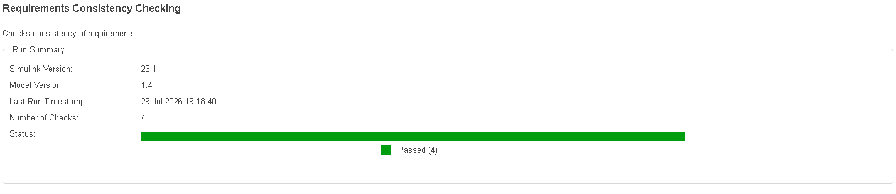

The generated report confirms that all four checks passed.

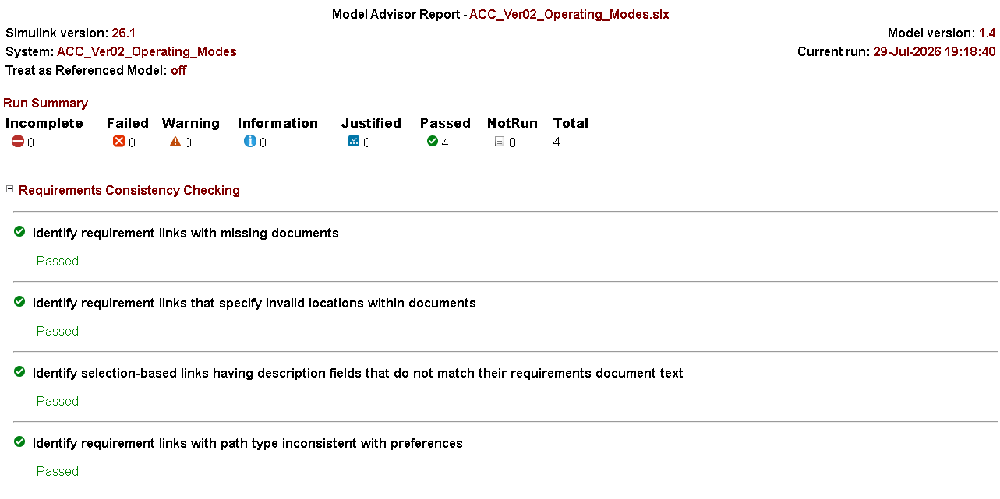

Generated report files:

```text
results/ACC_Ver02_Operating_Modes_Requirements_Consistency_Check_Report.html
results/ACC_Ver02_Operating_Modes_Requirements_Consistency_Check_Report.pdf
```

### Consistency Check Result

| Check Category | Result |
|---|---|
| Missing requirements documents | Pass |
| Invalid link locations | Pass |
| Selection-based link-description consistency | Pass |
| Path-type consistency | Pass |

Overall result:

```text
4 checks passed
0 failed
0 warnings
0 incomplete
0 not run
```

---

## Traceability Matrix

A traceability matrix was generated after completing the final Ver. 02 requirement linking.

Selected evidence:

- [Traceability Matrix, Part 1](images/ACC_Ver02_Operating_Modes_Requirements_Traceability_Matrix_Part1.png)
- [Traceability Matrix, Part 2](images/ACC_Ver02_Operating_Modes_Requirements_Traceability_Matrix_Part2.png)
- [Traceability Matrix, Part 3](images/ACC_Ver02_Operating_Modes_Requirements_Traceability_Matrix_Part3.png)

Generated traceability files:

```text
results/ACC_Ver02_Operating_Modes_Requirements_Traceability_Matrix_Report.html
results/ACC_Ver02_Operating_Modes_Requirements_Traceability_Report.xlsx
```

The matrix confirms mapping between the nineteen requirements and the linked Simulink and Stateflow implementation elements.

---

# Simulation Verification

Ver. 02 was manually verified through seven behavioral simulation rounds.

Each round retained:

- one cooling-control scope image,
- one temperature-hysteresis scope image,
- selected Stateflow active-state screenshots,
- selected Symbols pane screenshots,
- selected top-level model screenshots.

The 14 retained scope images are stored in `results/`. The `images/` folder retains 196 evidence images; the README references representative links from that retained set for each round.

---

## Round 1: Core Power Off and Power On Regression Verification

Round 1 verifies inherited Power-Off and Power-On behavior before operating-mode testing.

### Verification focus

- Safe Power-Off initialization
- Power-On entry
- Default Power-On Standby
- Temperature-setpoint update
- Temperature-error calculation
- Standby fan behavior
- Cooling inhibition while operating modes are disabled
- Hysteresis-threshold applicability

### Scope results

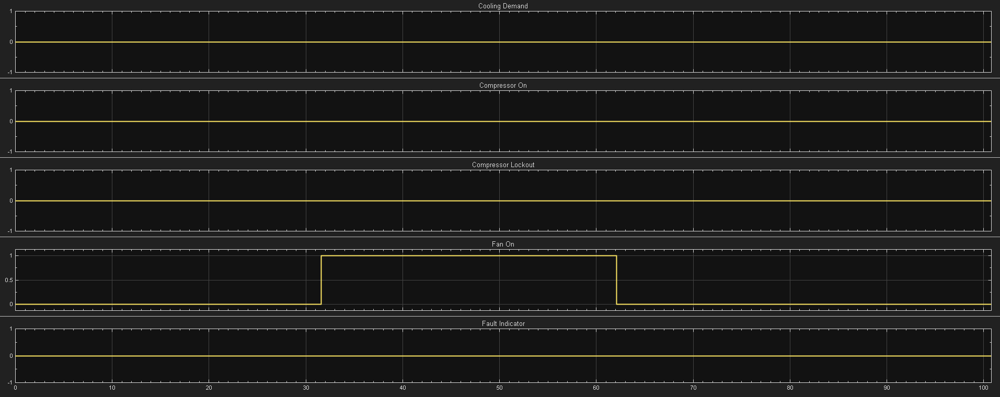

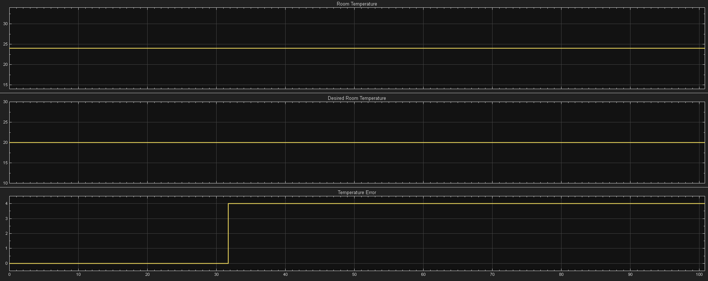


### Selected evidence

- **Power-Off initialization**: [Chart](images/ACC_Ver02_Operating_Modes_Chart_PowerOff.png), [Inputs](images/ACC_Ver02_Operating_Modes_Chart_Symbols_Pane_Controller_Inputs_During_PowerOff.png), [Outputs](images/ACC_Ver02_Operating_Modes_Chart_Symbols_Pane_Controller_Outputs_During_PowerOff.png), [Model](images/ACC_Ver02_Operating_Modes_Model_PowerOff.png)
- **Power-On Standby**: [Chart](images/ACC_Ver02_Operating_Modes_Chart_PowerOn_Standby.png), [Inputs](images/ACC_Ver02_Operating_Modes_Chart_Symbols_Pane_Controller_Inputs_During_PowerOn_Standby.png), [Outputs](images/ACC_Ver02_Operating_Modes_Chart_Symbols_Pane_Controller_Outputs_During_PowerOn_Standby.png), [Parameters](images/ACC_Ver02_Operating_Modes_Chart_Symbols_Pane_Controller_Parameters_During_PowerOn_Standby.png), [Model](images/ACC_Ver02_Operating_Modes_Model_PowerOn_Standby.png)
- **Standby applicability, case 1**: [Inputs](images/ACC_Ver02_Operating_Modes_Chart_Symbols_Pane_Controller_Inputs_During_PowerOn_Standby_Case1.png), [Outputs](images/ACC_Ver02_Operating_Modes_Chart_Symbols_Pane_Controller_Outputs_During_PowerOn_Standby_Case1.png), [Parameters](images/ACC_Ver02_Operating_Modes_Chart_Symbols_Pane_Controller_Parameters_During_PowerOn_Standby_Case1.png)
- **Standby applicability, case 2**: [Inputs](images/ACC_Ver02_Operating_Modes_Chart_Symbols_Pane_Controller_Inputs_During_PowerOn_Standby_Case2.png), [Outputs](images/ACC_Ver02_Operating_Modes_Chart_Symbols_Pane_Controller_Outputs_During_PowerOn_Standby_Case2.png), [Parameters](images/ACC_Ver02_Operating_Modes_Chart_Symbols_Pane_Controller_Parameters_During_PowerOn_Standby_Case2.png)
- **Additional chart views**: [Cooling control during standby](images/ACC_Ver02_Operating_Modes_Chart_Cooling_Control_State_During_PowerOn_Standby.png), [Automatic and manual fan-speed selection during standby](images/ACC_Ver02_Operating_Modes_Chart_Automatic_and_Manual_Fan_Speed_Selection_During_PowerOn_Standby.png)

### Key observations

- Power-Off initializes all physical control outputs safely.
- Power-On enters `Power_On_Standby`.
- The fan operates at Low Speed in standby.
- Cooling remains disabled even when temperature error crosses the cooling threshold.
- The temperature reference and temperature error update correctly.
- Operating-mode status outputs remain inactive in standby.

### Result: **Pass**

---

## Round 2: Power-On Standby and Operating-Mode Transition Verification

Round 2 verifies transition between standby and the operating-mode hierarchy.

### Sequence

```text
Power_On_Standby
-> Power_On_Operating_Modes
-> selected operating mode
-> Power_On_Standby
```

### Scope results

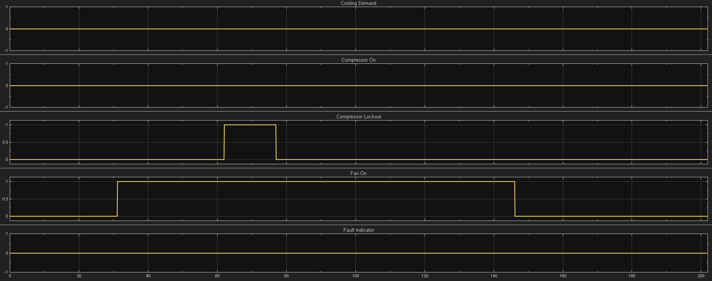

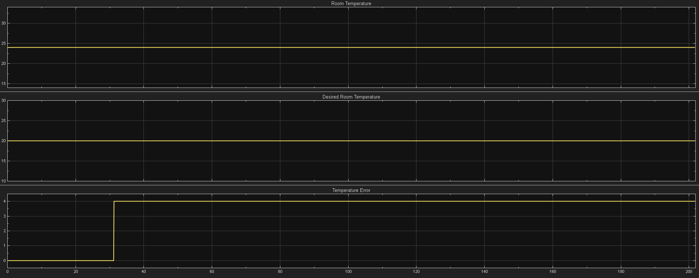


### Selected evidence

- **Standby initialization, case 1**: [Inputs](images/ACC_Ver02_Operating_Modes_Chart_Symbols_Pane_Power_On_Standby_Initialization_Controller_Inputs_Case_1.png), [Outputs](images/ACC_Ver02_Operating_Modes_Chart_Symbols_Pane_Power_On_Standby_Initialization_Controller_Outputs_Case_1.png), [Parameters](images/ACC_Ver02_Operating_Modes_Chart_Symbols_Pane_Power_On_Standby_Initialization_Controller_Parameters_Case_1.png)
- **Standby initialization, case 2**: [Inputs](images/ACC_Ver02_Operating_Modes_Chart_Symbols_Pane_Power_On_Standby_Initialization_Controller_Inputs_Case_2.png), [Outputs](images/ACC_Ver02_Operating_Modes_Chart_Symbols_Pane_Power_On_Standby_Initialization_Controller_Outputs_Case_2.png), [Parameters](images/ACC_Ver02_Operating_Modes_Chart_Symbols_Pane_Power_On_Standby_Initialization_Controller_Parameters_Case_2.png)
- **Power_On_Standby to Power_On_Operating_Modes**: [Chart](images/ACC_Ver02_Operating_Modes_Chart_Power_On_Standby_to_Power_On_Operating_Mode.png), [Controller Inputs Case 1](images/ACC_Ver02_Operating_Modes_Chart_Power_On_Standby_to_Power_On_Operating_Mode_Controller_Inputs_Case_1.png), [Controller Outputs Case 1](images/ACC_Ver02_Operating_Modes_Chart_Power_On_Standby_to_Power_On_Operating_Mode_Controller_Outputs_Case_1.png), [Controller Parameters Case 1](images/ACC_Ver02_Operating_Modes_Chart_Power_On_Standby_to_Power_On_Operating_Mode_Controller_Parameters_Case_1.png), [Model](images/ACC_Ver02_Operating_Modes_Model_Power_On_Standby_to_Power_On_Operating_Mode.png)
- **Power_On_Operating_Modes to Power_On_Standby**: [Chart](images/ACC_Ver02_Operating_Modes_Chart_Power_On_Operating_Mode_to_Power_On_Standby.png), [Controller Inputs Case 2](images/ACC_Ver02_Operating_Modes_Chart_Power_On_Standby_to_Power_On_Operating_Mode_Controller_Inputs_Case_2.png), [Controller Outputs Case 2](images/ACC_Ver02_Operating_Modes_Chart_Power_On_Standby_to_Power_On_Operating_Mode_Controller_Outputs_Case_2.png), [Controller Parameters Case 2](images/ACC_Ver02_Operating_Modes_Chart_Power_On_Standby_to_Power_On_Operating_Mode_Controller_Parameters_Case_2.png), [Model](images/ACC_Ver02_Operating_Modes_Model_Power_On_Operating_Mode_to_Power_On_Standby.png)

### Key observations

- `mode_enabled` controls entry into and exit from the operating-mode hierarchy.
- Returning to standby disables cooling control.
- Cooling demand and compressor outputs are cleared on standby return.
- The fan returns to Low-Speed standby behavior.
- Operating-mode status outputs are cleared in standby.

### Result: **Pass**

---

## Round 3: Fan-only Mode and Manual Fan-Speed Verification

Round 3 verifies Fan-only Mode and manual speed selection.

### Verification focus

- Fan-only Mode activation
- Compressor OFF behavior
- Cooling-demand inhibition
- Low, Medium, and High manual fan-speed mapping
- Invalid manual-input fallback
- Return to standby

### Scope results

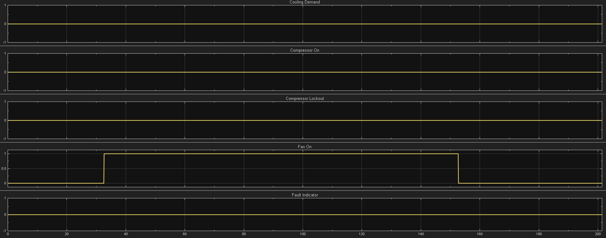

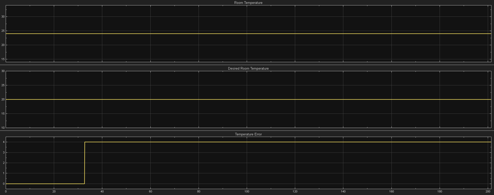


### Selected evidence

- **Fan-only Mode activation**: [Chart](images/ACC_Ver02_Operating_Modes_Chart_Fan_Only_Mode_Activation.png), [Cooling-control view](images/ACC_Ver02_Operating_Modes_Chart_Cooling_Control_During_Fan_Only_Mode_Activation.png), [Automatic and manual fan-speed view](images/ACC_Ver02_Operating_Modes_Chart_Automatic_and_Manual_Fan_Speed_Selection_During_Fan_Only_Mode_Activation.png)
- **Low Speed selection**: [Inputs](images/ACC_Ver02_Operating_Modes_Chart_Symbols_Pane_Fan_Only_Mode_Activation_With_Low_Speed_Controller_Inputs.png), [Outputs](images/ACC_Ver02_Operating_Modes_Chart_Symbols_Pane_Fan_Only_Mode_Activation_With_Low_Speed_Controller_Outputs.png), [Model](images/ACC_Ver02_Operating_Modes_Model_Fan_Only_Mode_Activation_With_Low_Speed.png)
- **Medium Speed selection**: [Inputs](images/ACC_Ver02_Operating_Modes_Chart_Symbols_Pane_Fan_Only_Mode_Activation_With_Medium_Speed_Controller_Inputs.png), [Outputs](images/ACC_Ver02_Operating_Modes_Chart_Symbols_Pane_Fan_Only_Mode_Activation_With_Medium_Speed_Controller_Outputs.png), [Model](images/ACC_Ver02_Operating_Modes_Model_Fan_Only_Mode_Activation_With_Medium_Speed.png)
- **High Speed selection**: [Inputs](images/ACC_Ver02_Operating_Modes_Chart_Symbols_Pane_Fan_Only_Mode_Activation_With_High_Speed_Controller_Inputs.png), [Outputs](images/ACC_Ver02_Operating_Modes_Chart_Symbols_Pane_Fan_Only_Mode_Activation_With_High_Speed_Controller_Outputs.png), [Model](images/ACC_Ver02_Operating_Modes_Model_Fan_Only_Mode_Activation_With_High_Speed.png)
- **Invalid input fallback**: [Inputs](images/ACC_Ver02_Operating_Modes_Chart_Symbols_Pane_Fan_Only_Mode_Activation_With_Invalid_Speed_Controller_Inputs.png), [Outputs](images/ACC_Ver02_Operating_Modes_Chart_Symbols_Pane_Fan_Only_Mode_Activation_With_Invalid_Speed_Controller_Outputs.png), [Parameters](images/ACC_Ver02_Operating_Modes_Chart_Symbols_Pane_Fan_Only_Mode_Activation_With_Invalid_Speed_Controller_Parameters.png), [Model](images/ACC_Ver02_Operating_Modes_Model_Fan_Only_Mode_Activation_With_Invalid_Speed.png)

### Key observations

- Cooling control remains disabled throughout Fan-only Mode.
- Cooling demand and compressor command remain 0 despite positive temperature error.
- Manual fan-speed selection produces Low, Medium, and High commands.
- An unsupported manual input falls back to Low Speed.
- Fan-only Mode does not activate automatic fan-speed selection.

### Result: **Pass**

---

## Round 4: Cooling Mode and Core-Control Regression Verification

Round 4 verifies that Cooling Mode preserves the Ver. 01 core-control behavior.

### Verification focus

- Cooling Mode activation
- Fresh compressor lockout
- Compressor activation after lockout expiry
- Cooling-demand hysteresis
- Compressor deactivation
- Post-deactivation compressor lockout
- OFF-and-ready compressor state
- Fan run-on
- Fan deactivation after timeout
- Immediate restart from ready state
- Manual fan-speed selection

### Scope results

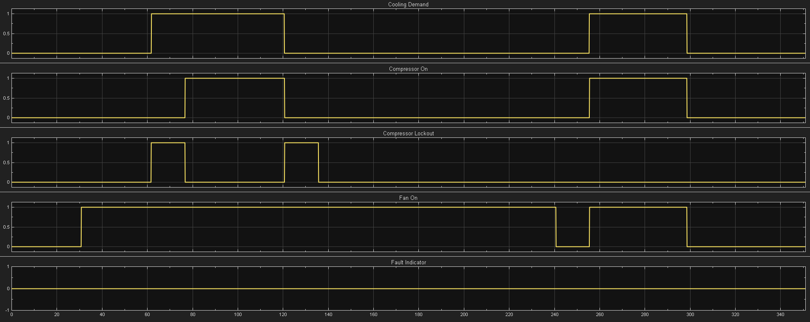

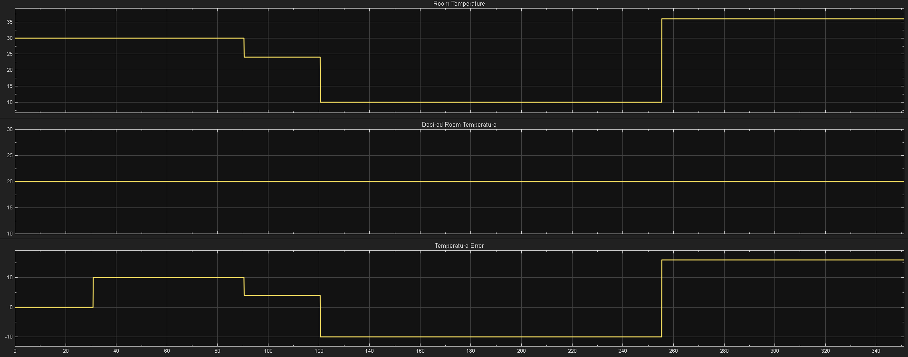

### Approximate timing checks

| Check | Approximate duration |
|---|---:|
| Fresh compressor lockout | 15 s |
| Post-deactivation compressor lockout | 15 s |
| Fan run-on | 120 s |


### Selected evidence

- **Cooling Mode entry and fresh lockout**: [Mode-control chart](images/ACC_Ver02_Operating_Modes_Chart_Mode_Activation_During_Cooling_Mode_Activation_and_Fresh_Lockout_Check.png), [Cooling-control chart](images/ACC_Ver02_Operating_Modes_Chart_Cooling_Control_Mechanism_During_Cooling_Mode_Activation_and_Fresh_Lockout_Check.png), [Controller Inputs](images/ACC_Ver02_Operating_Modes_Chart_Symbols_Pane_Cooling_Mode_Activation_and_Fresh_Lockout_Check_Controller_Inputs.png), [Controller Outputs](images/ACC_Ver02_Operating_Modes_Chart_Symbols_Pane_Cooling_Mode_Activation_and_Fresh_Lockout_Check_Controller_Outputs.png), [Controller Parameters](images/ACC_Ver02_Operating_Modes_Chart_Symbols_Pane_Cooling_Mode_Activation_and_Fresh_Lockout_Check_Controller_Parameters.png), [Model](images/ACC_Ver02_Operating_Modes_Model_Cooling_Mode_Activation_and_Fresh_Lockout_Check.png)
- **Compressor activation after lockout expiry**: [Chart](images/ACC_Ver02_Operating_Modes_Chart_Compressor_Activation_After_Lockout_Expiry_and_Temp_Hysteresis_Band_Check_Controller_Inputs.png), [Symbols Inputs](images/ACC_Ver02_Operating_Modes_Chart_Symbols_Pane_Compressor_Activation_After_Lockout_Expiry_and_Temp_Hysteresis_Band_Check_Controller_Inputs.png), [Symbols Outputs](images/ACC_Ver02_Operating_Modes_Chart_Symbols_Pane_Compressor_Activation_After_Lockout_Expiry_and_Temp_Hysteresis_Band_Check_Controller_Outputs.png)
- **Cooling-demand deactivation**: [Chart](images/ACC_Ver02_Operating_Modes_Chart_Cooling_Demand_Deactivation.png), [Symbols Inputs](images/ACC_Ver02_Operating_Modes_Chart_Symbols_Pane_Cooling_Demand_Deactivation_Controller_Inputs.png), [Symbols Outputs](images/ACC_Ver02_Operating_Modes_Chart_Symbols_Pane_Cooling_Demand_Deactivation_Controller_Outputs.png)
- **Fan run-on expiry**: [Chart](images/ACC_Ver02_Operating_Modes_Chart_Fan_Run_On_Expiry_Check.png), [Symbols Inputs](images/ACC_Ver02_Operating_Modes_Chart_Symbols_Pane_Fan_Run_On_Expiry_Check_Controller_Inputs.png), [Symbols Outputs](images/ACC_Ver02_Operating_Modes_Chart_Symbols_Pane_Fan_Run_On_Expiry_Check_Controller_Outputs.png), [Symbols Parameters](images/ACC_Ver02_Operating_Modes_Chart_Symbols_Pane_Fan_Run_On_Expiry_Check_Controller_Parameters.png)
- **Immediate restart from OFF-ready state**: [Chart](images/ACC_Ver02_Operating_Modes_Chart_Immediate_Restart_From_Ready_State_Check.png), [Symbols Inputs](images/ACC_Ver02_Operating_Modes_Chart_Symbols_Pane_Immediate_Restart_From_Ready_State_Check_Controller_Inputs.png), [Symbols Outputs](images/ACC_Ver02_Operating_Modes_Chart_Symbols_Pane_Immediate_Restart_From_Ready_State_Check_Controller_Outputs.png)

### Key observations

- Cooling Mode enables the shared cooling mechanism.
- A fresh lockout is applied after cooling-control activation.
- Compressor activation occurs only after lockout expiry.
- Hysteresis prevents rapid demand switching.
- Demand removal immediately turns the compressor OFF.
- The fan remains ON during run-on.
- The compressor reaches an OFF-and-ready state after minimum-OFF-time expiry.
- Demand reactivation from the ready state permits immediate compressor activation.
- Manual fan-speed control remains available in Cooling Mode.

### Result: **Pass**

---

## Round 5: Automatic Mode and Automatic Fan-Speed Verification

Round 5 verifies Automatic Mode and automatic fan-speed selection.

### Verification focus

- Automatic Mode activation
- Fresh compressor lockout
- Low Speed while compressor is OFF
- High Speed at high temperature error
- Medium Speed at intermediate temperature error
- Low Speed at lower positive temperature error
- Low Speed during compressor-OFF fan run-on
- Fan command OFF after run-on expiry

### Scope results

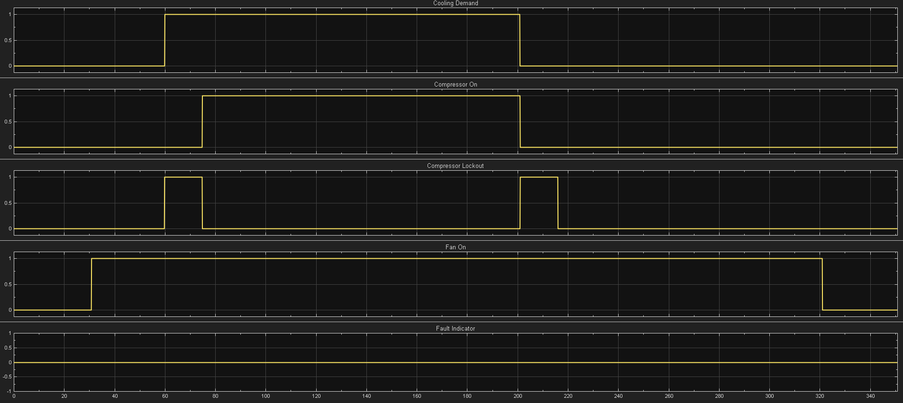

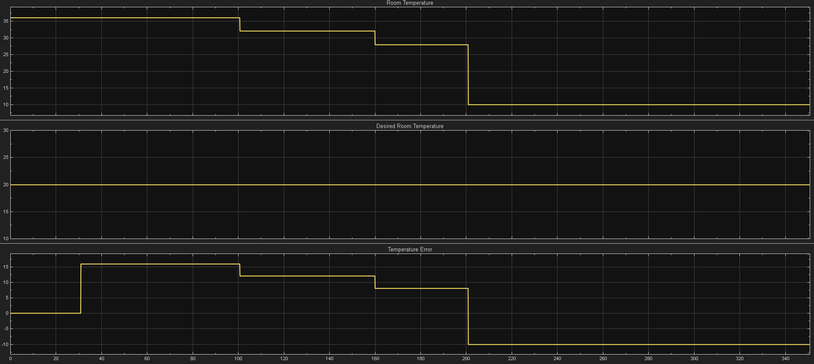


### Selected evidence

- **Automatic Mode activation and fresh lockout**: [Mode-control chart](images/ACC_Ver02_Operating_Modes_Chart_Mode_Activation_During_Automatic_Mode_Activation_and_Fresh_Lockout_Check.png), [Cooling-control chart](images/ACC_Ver02_Operating_Modes_Chart_Cooling_Control_Mechanism_During_Automatic_Mode_Activation_and_Fresh_Lockout_Check.png), [Fan-speed chart](images/ACC_Ver02_Operating_Modes_Chart_Automatic_and_Manual_Fan_Speed_Selection_During_Automatic_Mode_Activation_and_Fresh_Lockout_Check.png), [Controller Inputs](images/ACC_Ver02_Operating_Modes_Chart_Symbols_Pane_Mode_Activation_During_Automatic_Mode_Activation_and_Fresh_Lockout_Check_Controller_Inputs.png), [Controller Outputs](images/ACC_Ver02_Operating_Modes_Chart_Symbols_Pane_Mode_Activation_During_Automatic_Mode_Activation_and_Fresh_Lockout_Check_Controller_Outputs.png), [Controller Parameters](images/ACC_Ver02_Operating_Modes_Chart_Symbols_Pane_Mode_Activation_During_Automatic_Mode_Activation_and_Fresh_Lockout_Check_Controller_Parameters.png), [Model](images/ACC_Ver02_Operating_Modes_Model_Mode_Activation_During_Automatic_Mode_Activation_and_Fresh_Lockout_Check.png)
- **High Speed after compressor activation**: [Chart](images/ACC_Ver02_Operating_Modes_Chart_High_Speed_Selection_After_Compressor_Activation_During_Automatic_Mode_Activation_and_Fresh_Lockout_Check.png), [Symbols Inputs](images/ACC_Ver02_Operating_Modes_Chart_Symbols_Pane_High_Speed_Selection_After_Compressor_Activation_During_Automatic_Mode_Activation_and_Fresh_Lockout_Check_Controller_Inputs.png), [Symbols Outputs](images/ACC_Ver02_Operating_Modes_Chart_Symbols_Pane_High_Speed_Selection_After_Compressor_Activation_During_Automatic_Mode_Activation_and_Fresh_Lockout_Check_Controller_Outputs.png), [Model](images/ACC_Ver02_Operating_Modes_Model_High_Speed_Selection_After_Compressor_Activation_During_Automatic_Mode_Activation_and_Fresh_Lockout_Check.png)
- **Medium Speed selection**: [Symbols Inputs](images/ACC_Ver02_Operating_Modes_Chart_Symbols_Pane_Medium_Speed_Selection_During_Automatic_Mode_Activation_and_Fresh_Lockout_Check_Controller_Inputs.png), [Symbols Outputs](images/ACC_Ver02_Operating_Modes_Chart_Symbols_Pane_Medium_Speed_Selection_During_Automatic_Mode_Activation_and_Fresh_Lockout_Check_Controller_Outputs.png), [Model](images/ACC_Ver02_Operating_Modes_Model_Medium_Speed_Selection_During_Automatic_Mode_Activation_and_Fresh_Lockout_Check.png)
- **Low Speed during active cooling**: [Symbols Inputs](images/ACC_Ver02_Operating_Modes_Chart_Symbols_Pane_Low_Speed_Selection_During_Active_Cooling_During_Automatic_Mode_Activation_and_Fresh_Lockout_Check_Controller_Inputs.png), [Symbols Outputs](images/ACC_Ver02_Operating_Modes_Chart_Symbols_Pane_Low_Speed_Selection_During_Active_Cooling_During_Automatic_Mode_Activation_and_Fresh_Lockout_Check_Controller_Outputs.png), [Model](images/ACC_Ver02_Operating_Modes_Model_Low_Speed_Selection_During_Active_Cooling_During_Automatic_Mode_Activation_and_Fresh_Lockout_Check.png)
- **Low Speed while compressor is OFF**: [Chart](images/ACC_Ver02_Operating_Modes_Chart_Low_Speed_While_Compressor_is_OFF_During_Automatic_Mode_Activation_and_Fresh_Lockout_Check.png), [Symbols Inputs](images/ACC_Ver02_Operating_Modes_Chart_Symbols_Pane_Low_Speed_While_Compressor_is_OFF_During_Automatic_Mode_Activation_and_Fresh_Lockout_Check_Controller_Inputs.png), [Symbols Outputs](images/ACC_Ver02_Operating_Modes_Chart_Symbols_Pane_Low_Speed_While_Compressor_is_OFF_During_Automatic_Mode_Activation_and_Fresh_Lockout_Check_Controller_Outputs.png)
- **Fan OFF after run-on expiry**: [Chart](images/ACC_Ver02_Operating_Modes_Chart_Fan_OFF_After_Fan_Run_On_Expiry_During_Automatic_Mode_Activation_and_Fresh_Lockout_Check.png), [Symbols Inputs](images/ACC_Ver02_Operating_Modes_Chart_Symbols_Pane_Fan_OFF_After_Fan_Run_On_Expiry_During_Automatic_Mode_Activation_and_Fresh_Lockout_Check_Controller_Inputs.png), [Symbols Outputs](images/ACC_Ver02_Operating_Modes_Chart_Symbols_Pane_Fan_OFF_After_Fan_Run_On_Expiry_During_Automatic_Mode_Activation_and_Fresh_Lockout_Check_Controller_Outputs.png), [Symbols Parameters](images/ACC_Ver02_Operating_Modes_Chart_Symbols_Pane_Fan_OFF_After_Fan_Run_On_Expiry_During_Automatic_Mode_Activation_and_Fresh_Lockout_Check_Controller_Parameters.png)

### Key observations

- Automatic Mode enables cooling control and automatic fan-speed selection.
- Compressor-OFF operation commands Low Speed while the fan remains active.
- Fan speed changes continuously with temperature-error magnitude.
- The high-threshold equality boundary selects High Speed.
- Fan run-on uses Low Speed after compressor shutdown.
- Fan command becomes 0 after run-on expiry.

### Result: **Pass**

---

## Round 6: Manual Override and Cross-Mode Transition Verification

Round 6 verifies Automatic Mode manual override and cross-mode behavior.

### Verification focus

- Automatic fan-speed operation before override
- Manual override activation
- Manual fan-speed changes while Automatic Mode remains active
- Return from manual override to automatic selection
- Automatic Mode to Cooling Mode continuity
- Cooling Mode to Fan-only Mode cooling disable
- Fan-only Mode to Automatic Mode fresh lockout
- Automatic Mode to Power-On Standby

### Scope results

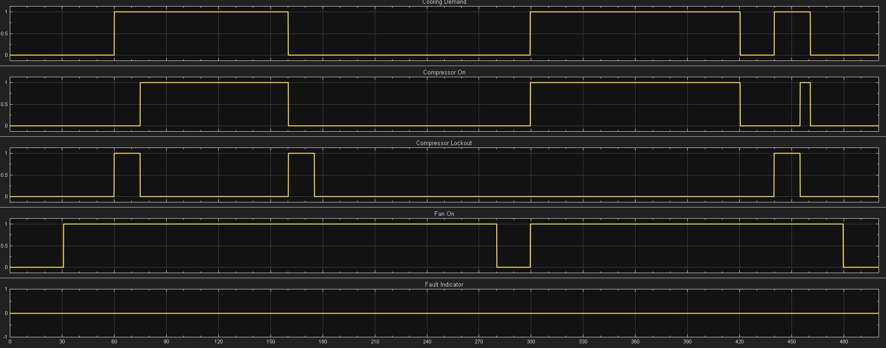

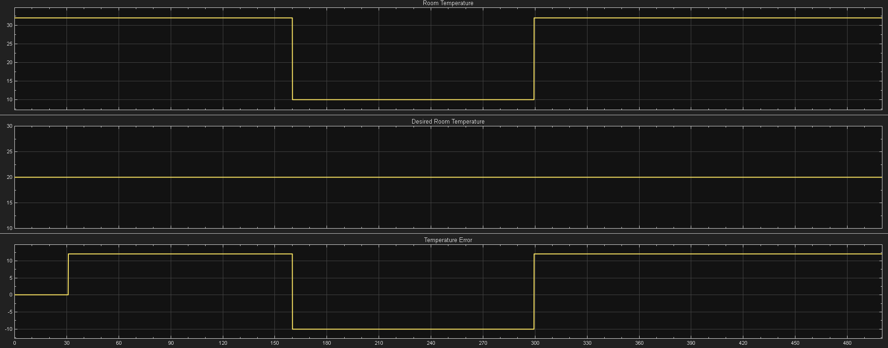


### Selected evidence

- **Automatic Mode before manual override**: [Operating-mode chart](images/ACC_Ver02_Operating_Modes_Chart_Operating_Mode_Control_Automatic_Mode_Before_Manual_Override_Activation.png), [Cooling-control chart](images/ACC_Ver02_Operating_Modes_Chart_Cooling_Control_Mechanism_Automatic_Mode_Before_Manual_Override_Activation.png), [Fan-speed chart](images/ACC_Ver02_Operating_Modes_Chart_Automatic_and_Manual_Fan_Speed_Selection_Automatic_Mode_Before_Manual_Override_Activation.png), [Controller Inputs](images/ACC_Ver02_Operating_Modes_Chart_Symbols_Pane_Automatic_Mode_Before_Manual_Override_Activation_Controller_Inputs.png), [Controller Outputs](images/ACC_Ver02_Operating_Modes_Chart_Symbols_Pane_Automatic_Mode_Before_Manual_Override_Activation_Controller_Outputs.png), [Model](images/ACC_Ver02_Operating_Modes_Model_Automatic_Mode_Before_Manual_Override_Activation.png)
- **Manual override active**: [Operating-mode chart](images/ACC_Ver02_Operating_Modes_Chart_Operating_Mode_Control_Automatic_Mode_After_Manual_Override_Activation.png), [Fan-speed chart](images/ACC_Ver02_Operating_Modes_Chart_Automatic_and_Manual_Fan_Speed_Selection_Automatic_Mode_After_Manual_Override_Activation.png), [Model](images/ACC_Ver02_Operating_Modes_Model_Automatic_Mode_After_Manual_Override_Activation.png)
- **Manual override fan-speed changes**: [High to Medium Inputs](images/ACC_Ver02_Operating_Modes_Chart_Symbols_Pane_Automatic_Mode_After_Manual_Override_Activation_High_to_Medium_Manual_Fan_Speed_Controller_Inputs.png), [High to Medium Outputs](images/ACC_Ver02_Operating_Modes_Chart_Symbols_Pane_Automatic_Mode_After_Manual_Override_Activation_High_to_Medium_Manual_Fan_Speed_Controller_Outputs.png), [High to Medium Parameters](images/ACC_Ver02_Operating_Modes_Chart_Symbols_Pane_Automatic_Mode_After_Manual_Override_Activation_High_to_Medium_Manual_Fan_Speed_Controller_Parameters.png), [Model](images/ACC_Ver02_Operating_Modes_Model_Automatic_Mode_After_Manual_Override_Activation_High_to_Medium_Manual_Fan_Speed.png), [Medium to Low Inputs](images/ACC_Ver02_Operating_Modes_Chart_Symbols_Pane_Automatic_Mode_After_Manual_Override_Activation_Medium_to_Low_Manual_Fan_Speed_Controller_Inputs.png), [Medium to Low Outputs](images/ACC_Ver02_Operating_Modes_Chart_Symbols_Pane_Automatic_Mode_After_Manual_Override_Activation_Medium_to_Low_Manual_Fan_Speed_Controller_Outputs.png), [Model](images/ACC_Ver02_Operating_Modes_Model_Automatic_Mode_After_Manual_Override_Activation_Medium_to_Low_Manual_Fan_Speed.png), [Low to Fan OFF Inputs](images/ACC_Ver02_Operating_Modes_Chart_Symbols_Pane_Automatic_Mode_After_Manual_Override_Activation_Low_Manual_Fan_Speed_to_Fan_OFF_Controller_Inputs.png), [Low to Fan OFF Outputs](images/ACC_Ver02_Operating_Modes_Chart_Symbols_Pane_Automatic_Mode_After_Manual_Override_Activation_Low_Manual_Fan_Speed_to_Fan_OFF_Controller_Outputs.png), [Model](images/ACC_Ver02_Operating_Modes_Model_Automatic_Mode_After_Manual_Override_Activation_Low_Manual_Fan_Speed_to_Fan_OFF.png)
- **Return from manual override to automatic selection**: [Controller Inputs](images/ACC_Ver02_Operating_Modes_Chart_Symbols_Pane_Automatic_Mode_Return_From_Manual_Override_to_Automatic_Selection_Controller_Inputs.png), [Controller Outputs](images/ACC_Ver02_Operating_Modes_Chart_Symbols_Pane_Automatic_Mode_Return_From_Manual_Override_to_Automatic_Selection_Controller_Outputs.png), [Controller Parameters](images/ACC_Ver02_Operating_Modes_Chart_Symbols_Pane_Automatic_Mode_Return_From_Manual_Override_to_Automatic_Selection_Controller_Parameters.png), [Model](images/ACC_Ver02_Operating_Modes_Model_Automatic_Mode_Return_From_Manual_Override_to_Automatic_Selection.png)
- **Automatic Mode to Cooling Mode**: [Chart](images/ACC_Ver02_Operating_Modes_Chart_Automatic_Mode_to_Cooling_Mode_Transition.png), [Cooling-control view](images/ACC_Ver02_Operating_Modes_Chart_Cooling_Control_Mechanism_During_Automatic_Mode_to_Cooling_Mode_Transition.png), [Fan-speed view](images/ACC_Ver02_Operating_Modes_Chart_Automatic_and_Manual_Fan_Speed_Selection_During_Automatic_Mode_to_Cooling_Mode_Transition.png), [Inputs](images/ACC_Ver02_Operating_Modes_Chart_Symbols_Pane_Automatic_Mode_to_Cooling_Mode_Transition_Controller_Inputs.png), [Outputs](images/ACC_Ver02_Operating_Modes_Chart_Symbols_Pane_Automatic_Mode_to_Cooling_Mode_Transition_Controller_Outputs.png), [Parameters](images/ACC_Ver02_Operating_Modes_Chart_Symbols_Pane_Automatic_Mode_to_Cooling_Mode_Transition_Controller_Parameters.png), [Model](images/ACC_Ver02_Operating_Modes_Model_Automatic_Mode_to_Cooling_Mode_Transition.png)
- **Cooling Mode to Fan-only Mode**: [Chart](images/ACC_Ver02_Operating_Modes_Chart_Cooling_Mode_to_Fan_Only_Mode_Transition.png), [Cooling-control view](images/ACC_Ver02_Operating_Modes_Chart_Cooling_Control_Mechanism_During_Cooling_Mode_to_Fan_Only_Mode_Transition.png), [Fan-speed view](images/ACC_Ver02_Operating_Modes_Chart_Automatic_and_Manual_Fan_Speed_Selection_During_Cooling_Mode_to_Fan_Only_Mode_Transition.png), [Inputs](images/ACC_Ver02_Operating_Modes_Chart_Symbols_Pane_Cooling_Mode_to_Fan_Only_Mode_Transition_Controller_Inputs.png), [Outputs](images/ACC_Ver02_Operating_Modes_Chart_Symbols_Pane_Cooling_Mode_to_Fan_Only_Mode_Transition_Controller_Outputs.png), [Parameters](images/ACC_Ver02_Operating_Modes_Chart_Symbols_Pane_Cooling_Mode_to_Fan_Only_Mode_Transition_Controller_Parameters.png), [Model](images/ACC_Ver02_Operating_Modes_Model_Cooling_Mode_to_Fan_Only_Mode_Transition.png)
- **Fan-only Mode to Automatic Mode**: [Chart](images/ACC_Ver02_Operating_Modes_Chart_Fan_Only_Mode_to_Automatic_Mode_Transition.png), [Cooling-control view](images/ACC_Ver02_Operating_Modes_Chart_Cooling_Control_Mechanism_During_Fan_Only_Mode_to_Automatic_Mode_Transition.png), [Fan-speed view](images/ACC_Ver02_Operating_Modes_Chart_Automatic_and_Manual_Fan_Speed_Selection_During_Fan_Only_Mode_to_Automatic_Mode_Transition.png), [Inputs](images/ACC_Ver02_Operating_Modes_Chart_Symbols_Pane_Fan_Only_Mode_to_Automatic_Mode_Transition_Controller_Inputs.png), [Outputs](images/ACC_Ver02_Operating_Modes_Chart_Symbols_Pane_Fan_Only_Mode_to_Automatic_Mode_Transition_Controller_Outputs.png), [Parameters](images/ACC_Ver02_Operating_Modes_Chart_Symbols_Pane_Fan_Only_Mode_to_Automatic_Mode_Transition_Controller_Parameters.png), [Model](images/ACC_Ver02_Operating_Modes_Model_Fan_Only_Mode_to_Automatic_Mode_Transition.png)
- **Automatic Mode to Power-On Standby**: [Operating-mode chart](images/ACC_Ver02_Operating_Modes_Chart_Operating_Mode_Control_During_Automatic_Mode_to_Power_On_Standby_Transition.png), [Cooling-control view](images/ACC_Ver02_Operating_Modes_Chart_Cooling_Control_Mechanism_During_Automatic_Mode_to_Power_On_Standby_Transition.png), [Fan-speed view](images/ACC_Ver02_Operating_Modes_Chart_Automatic_and_Manual_Fan_Speed_Control_During_Automatic_Mode_to_Power_On_Standby_Transition.png), [Inputs](images/ACC_Ver02_Operating_Modes_Chart_Symbols_Pane_Automatic_Mode_to_Power_On_Standby_Transition_Controller_Inputs.png), [Outputs](images/ACC_Ver02_Operating_Modes_Chart_Symbols_Pane_Automatic_Mode_to_Power_On_Standby_Transition_Controller_Outputs.png), [Parameters](images/ACC_Ver02_Operating_Modes_Chart_Symbols_Pane_Automatic_Mode_to_Power_On_Standby_Transition_Controller_Parameters.png), [Model](images/ACC_Ver02_Operating_Modes_Model_Automatic_Mode_to_Power_On_Standby_Transition.png)

### Key observations

- Manual override changes the fan-speed source without leaving Automatic Mode.
- Clearing override restores automatic fan-speed selection.
- Automatic-to-Cooling transition retains cooling-control state.
- No unnecessary fresh lockout occurs when cooling remains continuously enabled.
- Cooling-to-Fan-only transition clears cooling-control outputs.
- Fan-only-to-Automatic transition applies a fresh compressor lockout.
- Return to standby disables cooling and restores Low-Speed fan standby behavior.

### Result: **Pass**

---

## Round 7: Fault Activation and Reset Regression Verification

Round 7 verifies fault behavior after the Ver. 02 operating-mode enhancements.

### Sequence

```text
Automatic Mode with active cooling
-> Fault
-> invalid reset while fault remains active
-> fault cleared
-> valid reset to Power_On_Standby
-> Automatic Mode re-entry
-> fresh compressor lockout
-> second fault activation
-> invalid Power-Off reset while fault remains active
-> fault cleared
-> valid reset to Power_Off
```

### Scope results

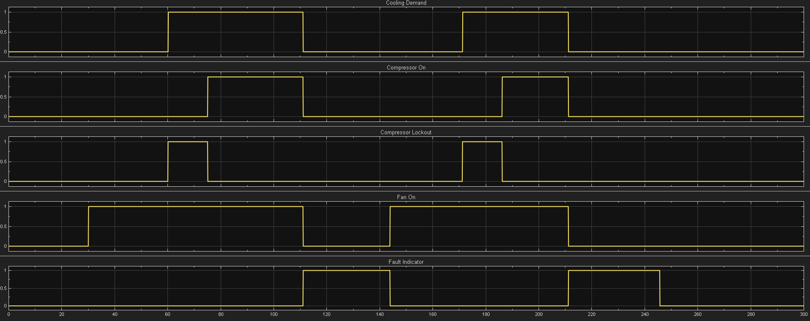

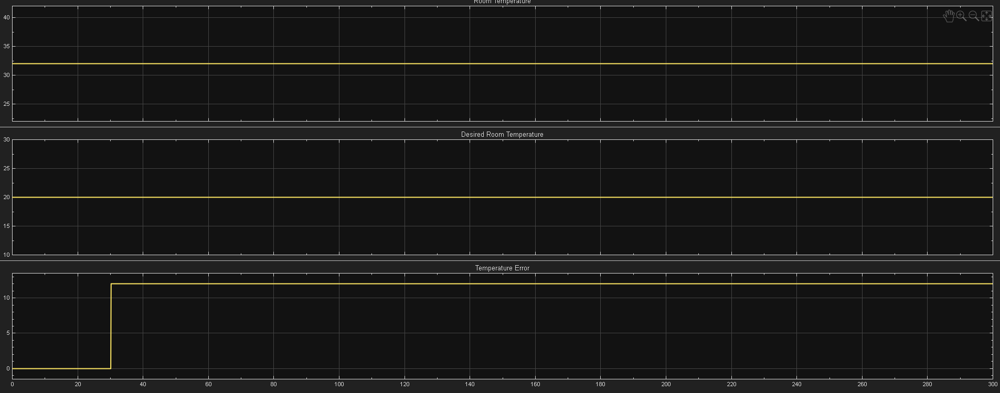


### Selected evidence

- **Automatic Mode before fault**: [Chart](images/ACC_Ver02_Operating_Modes_Chart_Automatic_Mode_Activation_With_Fresh_Compressor_Lockout_Before_Fault.png), [Cooling-control view](images/ACC_Ver02_Operating_Modes_Chart_Cooling_Control_Mechanism_During_Automatic_Mode_Activation_After_Compressor_Lockout_Expiry_Before_Fault.png), [Symbols Inputs](images/ACC_Ver02_Operating_Modes_Chart_Symbols_Pane_Automatic_Mode_Activation_After_Compressor_Lockout_Expiry_Before_Fault_Controller_Inputs.png), [Symbols Outputs](images/ACC_Ver02_Operating_Modes_Chart_Symbols_Pane_Automatic_Mode_Activation_After_Compressor_Lockout_Expiry_Before_Fault_Controller_Outputs.png), [Model](images/ACC_Ver02_Operating_Modes_Model_Automatic_Mode_Activation_After_Compressor_Lockout_Expiry_Before_Fault.png)
- **Fault activation**: [Chart](images/ACC_Ver02_Operating_Modes_Chart_Fault_Activation_During_Automatic_Mode_After_Compressor_Lockout_Expiry.png), [Symbols Inputs](images/ACC_Ver02_Operating_Modes_Chart_Symbols_Pane_Fault_Activation_During_Automatic_Mode_After_Compressor_Lockout_Expiry_Controller_Inputs.png), [Symbols Outputs](images/ACC_Ver02_Operating_Modes_Chart_Symbols_Pane_Fault_Activation_During_Automatic_Mode_After_Compressor_Lockout_Expiry_Controller_Outputs.png), [Model](images/ACC_Ver02_Operating_Modes_Model_Fault_Activation_During_Automatic_Mode_After_Compressor_Lockout_Expiry.png)
- **Invalid reset while fault remains active**: [Symbols Inputs](images/ACC_Ver02_Operating_Modes_Chart_Symbols_Pane_Fault_Reset_Failure_When_Fault_Still_Active_During_Automatic_Mode_After_Compressor_Lockout_Expiry_Controller_Inputs.png), [Symbols Outputs](images/ACC_Ver02_Operating_Modes_Chart_Symbols_Pane_Fault_Reset_Failure_When_Fault_Still_Active_During_Automatic_Mode_After_Compressor_Lockout_Expiry_Controller_Outputs.png), [Model](images/ACC_Ver02_Operating_Modes_Model_Fault_Reset_Failure_When_Fault_Still_Active_During_Automatic_Mode_After_Compressor_Lockout_Expiry.png)
- **Valid reset to Power-On Standby**: [Fan-speed view](images/ACC_Ver02_Operating_Modes_Chart_Automatic_and_Manual_Fan_Speed_Select_During_Valid_Fault_Reset_to_Power_On_Standby.png), [Cooling-control view](images/ACC_Ver02_Operating_Modes_Chart_Cooling_Control_Mechanism_During_Valid_Fault_Reset_to_Power_On_Standby.png), [Chart](images/ACC_Ver02_Operating_Modes_Chart_Valid_Fault_Reset_to_Power_On_Standby.png), [Model](images/ACC_Ver02_Operating_Modes_Model_Valid_Fault_Reset_to_Power_On_Standby.png)
- **Automatic re-entry before fault reactivation**: [Fresh lockout chart](images/ACC_Ver02_Operating_Modes_Chart_Automatic_Mode_Reactivation_With_Fresh_Compressor_Lockout_Before_Fault_Reactivation.png), [Cooling-control after expiry](images/ACC_Ver02_Operating_Modes_Chart_Cooling_Control_Mechanism_During_Automatic_Mode_Reactivation_After_Compressor_Lockout_Expiry_Before_Fault_Reactivation.png), [Cooling-control during fresh lockout](images/ACC_Ver02_Operating_Modes_Chart_Cooling_Control_Mechanism_During_Automatic_Mode_Reactivation_With_Fresh_Compressor_Lockout_Before_Fault_Reactivation.png), [Symbols Inputs](images/ACC_Ver02_Operating_Modes_Chart_Symbols_Pane_During_Automatic_Mode_Reactivation_With_Fresh_Compressor_Lockout_Before_Fault_Reactivation_Controller_Inputs.png), [Symbols Outputs](images/ACC_Ver02_Operating_Modes_Chart_Symbols_Pane_During_Automatic_Mode_Reactivation_With_Fresh_Compressor_Lockout_Before_Fault_Reactivation_Controller_Outputs.png), [Symbols Parameters](images/ACC_Ver02_Operating_Modes_Chart_Symbols_Pane_During_Automatic_Mode_Reactivation_With_Fresh_Compressor_Lockout_Before_Fault_Reactivation_Controller_Parameters.png), [Model after expiry](images/ACC_Ver02_Operating_Modes_Model_Automatic_Mode_Reactivation_After_Compressor_Lockout_Expiry_Before_Fault_Reactivation.png), [Model fresh lockout](images/ACC_Ver02_Operating_Modes_Model_Automatic_Mode_Reactivation_With_Fresh_Compressor_Lockout_Before_Fault_Reactivation.png)
- **Invalid Power-Off reset while fault remains active**: [Symbols Inputs](images/ACC_Ver02_Operating_Modes_Chart_Symbols_Pane_Fault_Reset_Failure_With_Active_Fault_During_Automatic_Mode_Reactivation_After_Compressor_Lockout_Expiry_Controller_Inputs.png), [Symbols Outputs](images/ACC_Ver02_Operating_Modes_Chart_Symbols_Pane_Fault_Reset_Failure_With_Active_Fault_During_Automatic_Mode_Reactivation_After_Compressor_Lockout_Expiry_Controller_Outputs.png)
- **Valid reset to Power Off**: [Symbols Inputs](images/ACC_Ver02_Operating_Modes_Chart_Symbols_Pane_Valid_Fault_Reset_to_Power_Off_Controller_Inputs.png), [Symbols Outputs](images/ACC_Ver02_Operating_Modes_Chart_Symbols_Pane_Valid_Fault_Reset_to_Power_Off_Controller_Outputs.png), [Chart](images/ACC_Ver02_Operating_Modes_Chart_Valid_Fault_Reset_to_Power_Off.png), [Model](images/ACC_Ver02_Operating_Modes_Model_Valid_Fault_Reset_to_Power_Off.png)

### Key observations

- Fault activation overrides active Automatic Mode cooling.
- Physical cooling-control outputs move immediately to safe values.
- Reset remains blocked while `fault == 1`.
- Valid reset with `power_button == 1` returns the controller to Power-On Standby.
- Automatic Mode re-entry after reset applies a fresh compressor lockout.
- A Power-Off reset request is also rejected while the fault remains active.
- Valid reset with `power_button == 0` returns the controller to `Power_Off`.

### Result: **Pass**

---

## Verification Summary

| Verification Item | Requirement Coverage | Status |
|---|---|---|
| System initialization | ACC-REQ-001 | ✅ Pass |
| Temperature setpoint handling | ACC-REQ-002 | ✅ Pass |
| Power ON behavior | ACC-REQ-003 | ✅ Pass |
| Power OFF behavior | ACC-REQ-004 | ✅ Pass |
| Cooling-demand activation | ACC-REQ-005 | ✅ Pass |
| Cooling-demand deactivation | ACC-REQ-006 | ✅ Pass |
| Compressor minimum-OFF-time protection | ACC-REQ-007 | ✅ Pass |
| Compressor activation | ACC-REQ-008 | ✅ Pass |
| Compressor deactivation | ACC-REQ-009 | ✅ Pass |
| Fan activation during compressor operation | ACC-REQ-010 | ✅ Pass |
| Fan run-on after compressor deactivation | ACC-REQ-011 | ✅ Pass |
| Default Power-On Standby | ACC-REQ-012 | ✅ Pass |
| Fan-only Mode | ACC-REQ-013 | ✅ Pass |
| Cooling Mode | ACC-REQ-014 | ✅ Pass |
| Automatic Mode | ACC-REQ-015 | ✅ Pass |
| Automatic fan-speed selection | ACC-REQ-016 | ✅ Pass |
| Manual fan-speed selection and override | ACC-REQ-017 | ✅ Pass |
| Compressor-lockout status | ACC-REQ-018 | ✅ Pass |
| Fresh cooling-control activation lockout | ACC-REQ-019 | ✅ Pass |
| Generic fault activation | Supporting Ver. 02 behavior | ✅ Pass |
| Invalid reset blocking | Supporting Ver. 02 behavior | ✅ Pass |
| Valid reset to Power-On Standby | Supporting Ver. 02 behavior | ✅ Pass |
| Valid reset to Power Off | Supporting Ver. 02 behavior | ✅ Pass |
| Requirement authoring and linking | ACC-REQ-001 to ACC-REQ-019 | ✅ Pass |
| Requirements consistency check | Requirements Toolbox checks | ✅ Pass |
| Traceability matrix generation | Requirements to implementation | ✅ Pass |

---

## Observability and Requirement-Scope Note

Ver. 02 explicitly resets the physical cooling-control outputs during `Fault` and `Power_Off`:

```text
cooling_demand
compressor_on
compressor_lockout
fan_on
fan_speed_cmd
fault_indicator
```

However, the Ver. 01 and Ver. 02 requirements do not explicitly require the following operating-mode and internal supervisory values to be cleared in those top-level states:

```text
fan_only_mode_enabled
cooling_mode_enabled
automatic_mode_enabled
automatic_fan_speed_enabled
cooling_control_enabled
```

These values may therefore retain their most recently assigned values while the controller is in `Fault` or `Power_Off`.

This is documented as a requirement-scope limitation rather than a failed Ver. 02 requirement because the safety-priority physical outputs continue to reach their specified safe values.

Explicit fault-state and Power-Off clearing of supervisory status outputs is planned for a later version.

---

## Learning Outcomes

This version demonstrates:

- Requirement-based extension of an existing Stateflow controller
- Preservation of an earlier verified control baseline
- Hierarchical operating-mode supervision
- Parallel Stateflow mechanism coordination
- Shared cooling-control architecture
- Power-On Standby behavior
- Fan-only, Cooling, and Automatic modes
- Automatic fan-speed selection
- Manual fan-speed selection
- Manual override without mode exit
- Safe invalid-input fallback
- Cooling-control enable and disable gating
- Fresh compressor lockout after reactivation
- Compressor OFF-and-ready state design
- Continuous hysteresis evaluation
- Fan run-on preservation
- Cross-mode state continuity
- Regression-style simulation verification
- Manual checkpoint planning
- Scope-result interpretation
- Stateflow active-state evidence collection
- Symbols pane runtime-value evidence
- Requirement revision without altering the historical Ver. 01 baseline
- Requirement-to-model linking
- Requirements consistency checking
- Traceability matrix generation
- Documentation of requirement-scope limitations

---

## Limitations of Ver. 02

Ver. 02 does not include:

- Temperature-sensor plausibility checking
- Abrupt sensor-change detection
- Under-temperature and over-temperature monitoring
- Temperature timeout faults
- Invalid-mode fault handling
- Fault-specific diagnostic codes
- Explicit clearing of all supervisory mode-status outputs during `Fault`
- Explicit clearing of all supervisory mode-status outputs during `Power_Off`
- Dedicated controller-status output
- Top-level controller-status display
- Formal Simulink Test test harness
- Test Manager execution
- Automated pass/fail assessments
- Code-generation workflow
- Hardware deployment

These items are reserved for later controller versions and the subsequent validation workflow.

---

## Version Progression

| Version | Planned focus |
|---|---|
| Ver. 01 | Core control logic, temperature hysteresis, compressor protection, fan run-on, and generic fault-path verification |
| Ver. 02 | Operating-mode selection, automatic and manual fan-speed control, cross-mode transitions, and fresh cooling-control lockout |
| Ver. 03 | Sensor plausibility, operating-temperature monitoring, timeout faults, fault responses, and fault resets |
| Ver. 04 | Controller diagnostics, top-level observability, status output, and final model enhancement |

---

## Conclusion

ACC Ver. 02 successfully extends the verified Ver. 01 controller with operating-mode supervision and fan-speed control.

The controller demonstrates:

- Power-On Standby
- Fan-only Mode
- Cooling Mode
- Automatic Mode
- Automatic fan-speed selection
- Manual fan-speed selection
- Manual override in Automatic Mode
- Cooling-control continuity between Automatic and Cooling modes
- Safe cooling disable in Fan-only Mode and standby
- Fresh compressor lockout after cooling-control reactivation
- Compressor minimum-OFF-time protection
- Compressor OFF-and-ready behavior
- Fan run-on after compressor deactivation
- Generic fault override
- Invalid reset blocking
- Valid recovery to Power-On Standby
- Valid recovery to Power Off

The implementation is supported by nineteen authored requirements, linked Stateflow elements, four successful consistency checks, a generated traceability matrix, fourteen retained scope-result images, and seven rounds of behavioral simulation verification.

Ver. 02 provides the operating-mode foundation required for the next development stage, where sensor plausibility, operating-temperature monitoring, timeout faults, and fault-specific recovery logic can be introduced.

---

## License

MIT License

---

